# Can a photonic state-space model be trained on-chip? A pre-registered in-situ-training bake-off on a realistic silicon-nitride ring substrate

*Lucas Talandier — independent researcher, Paris*

**Abstract.** No physical photonic system has yet had the parameters that define a continuous-time dissipative-resonator recurrence — pole positions and inter-resonator couplings, the physics that *is* the memory — trained on the device by gradient-based or gradient-estimating methods.¹ We ask whether such training is feasible for a photonic state-space model on ultra-low-loss silicon nitride, and answer it in simulation: **on a pre-registered dissipative substrate model, both hardware-committed methods train the recurrence to within margin of the exact-gradient ceiling on 8/8 seeds at realistic noise.** Every threshold was frozen before the run that consumed it.

We derive the SSM↔ring mapping and its realizable pole region, build one shared substrate (finite Q, saturating gain, amplifier noise), and run a four-method bake-off. PAT needs 4.6× fewer device passes than model-free SPSA. The partial energy budget assigns SPSA 2.6 mJ in conversion energy and PAT 13–44 J in digital-twin energy; total training energy remains unmeasured. Hamiltonian-echo learning is censored — a quantified feasibility bound, the substrate's own dissipation defeating the echo. A measured controllability profile (one drive trains ≈3 of 32 rings; four taps recover all 32) makes the input map a first-class design axis — and the winning routes' trained solutions preserve it, converging on an estimator-independent damp-the-driven-rings profile whose interior contribution survives a registered taps-only falsifier, narrowly.

Against the decisive baseline — calibrate offline, deploy, retrain the readout — in-situ training is statistically indistinguishable at the base 5%-class calibration error and under common-mode drift. Its advantage appears only where nothing offline can follow: under uncorrelated per-ring drift it holds a pre-registered 2.42× advantage (a threshold-crossing under a frozen rule; the ratio's own CI spans [1.7, 4.6]). A registered inline-envelope follow-up finds no energy-advantage window at 0.1–2 GS/s against a per-tap digital equalizer (best digital/photonic ratio 0.64). Capacity remains a separate limitation: a registered ablation finds the deployed equalizer's output rides on 6–8 of 32 rings, and no workload in our data exercises more. One registered prediction — that the damping optimum tracks task memory span — failed, and is reported as failed. The pre-registration ledger, substrate model, and training code are released with the paper.

¹ *The nearest neighbor, an in-situ-trained optical recurrent network, trains interferometer weights around an optoelectronic relay; its resonators stay fixed.*

## 1. Introduction

### 1.1 The gap

Photonic neural networks have learned to train themselves. In feedforward meshes and diffractive
processors, on-chip training is now routine enough to have families: model-free perturbative
methods [1, 2], hybrid physical-forward/digital-backward methods
[3], and in-situ adjoint methods that read gradients from interference
[4]. But the systems that most need on-device training — *recurrent* photonic
processors, whose memory lives in the physics — have barely begun to receive it. Photonic reservoir
computing deliberately avoids the problem: the recurrence is fixed, random, and only a readout is
trained [5]. Where internal parameters of a photonic recurrence have been
adjusted at all, it has been by calibration or regime-tuning rather than task-driven training
[6], by reinforcement-style search over a readout while the loop stays fixed
[7], or in systems whose recurrent state is carried digitally between optical
passes [8]. A two-modality literature search with a pre-registered kill-criterion
(§8; supplementary) found no demonstration, by any method, of the following:

> **a continuous-time dissipative-resonator recurrence — pole positions and inter-resonator
> couplings — trained in situ on the physical device by gradient-based or gradient-estimating
> methods on a computational task.**

That sentence is this program's target, with each qualifier load-bearing: *on a computational
task* excludes the servo/calibration lineage; *physical parameters of the recurrence* excludes
hybrid-digital state carriage; *weight-tied recurrence* excludes feedforward meshes folded in
time. Refreshes of the search at assembly (2026-07-12) and a page-level verification round
(2026-07-27; memos in supplementary) map the boundary against the strongest 2025–26 neighbors,
which we dispatch by name because each is the "nearest miss" along one qualifier — and one of
them moved the boundary. The **nearest neighbor** is the monolithic optical recurrent
accelerator of Wu et al. [9]: its ORNN chip *is* trained in situ, by a
model-free perturbative method (SPGD, two physical evaluations per update) on a classification
task, with a weight-tied mesh applied across wavelength-encoded time steps — to our knowledge
the first in-situ-trained optical recurrent network of any kind, and we cite it as such. What
it does not do is train the parameters in the boxed sentence: its trained weights are
interferometer-mesh voltages, its recurrent state is re-generated electronically at every step
through a photodetector–modulator relay, and its resonators are calibrated once and held
static — the continuous-time dissipative-resonator recurrence, whose *poles and couplings are
themselves the memory*, remains untrained. The remaining near-misses each fall along one
qualifier: on-chip all-photonic backpropagation is now demonstrated — for a *feedforward*
network [10]; microring weight banks have been trained in situ through on-chip
optical backprop — as *feedforward* layers [11]; a time-synthetic fiber-loop
network trains in situ — with per-step distinct programmed parameters, i.e. unrolled
feedforward rather than a weight-tied recurrence [12]; a
modulation-and-weighting microring array trains weights sitting *inside* an analog recurrent
loop on-device — by particle-swarm search, explicitly without gradients
[13]; an optoelectronic delay reservoir has had recurrence-defining
parameters optimized in situ — by Bayesian search, through a digital feedback loop
[14]; and a silicon photonic reservoir equalizer is "trained in hardware" — its
readout only, by an evolution strategy, the reservoir couplings fixed by fabrication
[15]. No coupled-resonator lattice has had its couplings learned on-device by any
method. (The claim is time-indexed: the search refresh re-runs once more immediately before
submission, with the registered page-level reads listed in supplementary.)

### 1.2 Why a state-space model, and why silicon nitride

Two developments make this the right moment to close the gap. On the algorithmic side, deep
state-space models showed that *linear* recurrences with well-placed poles — not gated
nonlinear dynamics — carry most of long-sequence performance [16, 17], and the
oscillatory LinOSS line extended this to second-order units that are exactly coupled damped
oscillators [18, 19]. A lattice of coupled microrings *is* such a system:
poles are ring detunings and losses, couplings are physical couplers, and — decisively for
hardware — the LinOSS stability analysis tolerates nonnegative damping, so a lossy-but-high-Q
dissipative lattice is in-regime rather than an approximation to a conservative ideal (§2).
Damping becomes a design knob, not an embarrassment.

On the platform side, the figure of merit for a dissipative ring recurrence is memory per pass —
round-trip loss, hence intrinsic Q. Ultra-low-loss silicon nitride is class-leading and
foundry-accessible ($Q_i$ near $10^7$ on multi-project-wafer runs [20]), thermally
stable enough for the slow thermo-optic actuation that gradient-estimating training wants, and
needs so little gain that the injected amplifier noise stays low (§3). The same choice has a
cost we do not hide: SiN's weak $\chi^{(3)}$ makes the one training route that needs an optical
nonlinearity — Hamiltonian-echo learning, whose echo is phase conjugation — *harder*, not
easier, and §4–§5 treat that honestly rather than idealizing it away.

### 1.3 What this paper does

This is a theory-and-simulation (Stage-0) paper, built to be falsified before it is fabricated.
Its results are gated by a pre-registration ledger — margins, budgets, fairness conventions, and
statistical rules frozen (and PI-signed) before the runs that consume them, with the commit trail
shipped as supplementary material (§3.7). Concretely:

1. **A mapping with a realizable region** (§2): the oscillatory-SSM ↔ coupled-SiN-ring
   correspondence, with the pole region bounded by measured platform numbers, an actuation map
   for {δ, κ_ext, μ}, and the backscatter doublet carried as the model rather than a correction.
2. **A shared dissipative substrate** (§3): saturating Er gain at a registered operating point,
   Langevin ASE at NF 7 dB, three cells from foundry-floor to aspirational, a measured feasible
   box bounded by the lasing crossing, and a measured minimal multi-point input map after
   single-drive controllability was found to collapse (effective dimension ≈3 of 32 rings).
3. **A four-method bake-off under one fairness contract** (§4–§5): SPSA, PAT (with registered
   twin-mismatch), a recurrent in-situ adjoint (charged as if realizable; optimistic bound,
   labelled), and RHEL over a concrete χ³-FWM echo sub-model — scored by device passes to a
   pre-registered target relative to the exact-gradient ceiling, eight seeds, censoring-aware
   statistics.
4. **The result** (§5): both hardware-committed methods train the recurrence to within margin of
   the ceiling on all eight seeds — the sentence in §1.1, demonstrated in simulation at a
   foundry-class noise cell. The ranking (PAT < adjoint < SPSA on device passes; RHEL censored,
   and worse than readout-only under an honest echo) settles the hardware roadmap on PAT/SPSA
   without promotion of the exotic routes. And the comparison the fair design was built to
   expose lands as a mechanism triple: calibrate-then-deploy ties in-situ training at
   the base 5%-class calibration error (the higher-mismatch comparison is withdrawn
   after an implementation audit; §5.5) and under common-mode drift, which a laser re-lock
   absorbs — while under uncorrelated per-ring drift, which nothing offline can absorb,
   in-situ retraining holds a **declared, pre-registered 2.42× advantage** (both conditions
   of the frozen rule hold — point ratio ≥ 2× *and* difference-CI excluding zero; the
   coarse-floor estimate 1.84× is co-reported), a gap that grows with accumulated drift
   (§5.5, §7).
5. **Limits, stated as limits** (§8): robustness is measured against modelled imperfections
   only; the anchor risks, verification debts, and the single-session review period are
   disclosed with the same specificity as the results.

Our position on novelty is deliberately narrow. PAT and SPSA are chip-proven; we do not
re-validate them. What has never existed is a *recurrent, dissipative* photonic system trained
through its own physics — and a demonstration that the recurrence-defining parameters of a
realistic SiN lattice can be so trained, under pre-registered thresholds and honest costing, is
the contribution. Whether it *pays* is a separate question (§7), and this paper reports the
current answer to that question as it falls, not as we might wish it.

## 2. From oscillatory state-space models to coupled SiN microrings

### 2.1 The model class

A structured state-space model (SSM) processes a sequence $u_1, u_2, \dots$ through a linear
recurrence $x_{t+1} = \bar A x_t + \bar B u_t$, $y_t = \mathrm{Re}(\bar C x_t) + D u_t$, whose
expressive power is set by where the eigenvalues (poles) of $\bar A$ can be placed and how
precisely. The diagonal variants that dominate current practice — S4D and DSS [17, 21]
— reduce $\bar A$ to a set of independent complex poles, $H(s) = \sum_j c_j b_j/(s - \lambda_j) + D$;
the oscillatory LinOSS family [18] instead parameterizes forced, damped harmonic
oscillators, and its damped extension D-LinOSS [19] makes the damping of each mode a
trainable parameter. Crucially for what follows, the LinOSS construction is valid for any
nonnegative-diagonal (dissipative) state matrix: stability does not require conservative dynamics,
only that every mode decay. A physical substrate that is *lossy but slowly so* is therefore
in-regime by construction — the loss is not an error term to be fought but the damping parameter
of the model class itself. (Where in the damping range the trained optimum actually lands — and
what that does to the LinOSS-specific part of this motivation — is measured, not assumed; see
§6.)

### 2.2 One ring is one trainable complex pole

The mode amplitude $a_j$ of a silicon-nitride microring obeys temporal coupled-mode theory
(Haus energy-amplitude convention, $|a|^2$ = stored energy) [22]:

$$\dot a_j = (i\delta_j - \kappa_{\mathrm{tot},j})\,a_j
+ i\sum_{k\neq j}\mu_{jk}\,a_k + \sqrt{2\kappa_{\mathrm{ext},j}}\,u(t),$$

with $\kappa_{\mathrm{tot},j} = \kappa_{i,j} + 2\kappa_{\mathrm{ext},j}$ the amplitude decay rate
(intrinsic + both bus ports of the add–drop registry ring, each loading the mode at
$\kappa_\mathrm{ext}$; the drive enters through one port, hence the single
$\sqrt{2\kappa_{\mathrm{ext}}}$ injection term), $\delta_j$ the detuning of the drive from the ring resonance, and
$\mu_{jk}$ the inter-ring coupling. A single uncoupled ring is therefore exactly one **complex**
Laplace pole,

$$s_j = -\kappa_{\mathrm{tot},j} + i\,\delta_j,$$

— complex, not real, because the optical envelope carries a carrier. A bank of $N$ rings natively
realizes a **diagonal complex-pole SSM of the S4D/DSS class**: one ring per pole, with the
injection and readout couplings playing the role of the residues $c_j b_j$. The oscillatory
LinOSS unit is recovered *exactly* as the uncoupled, real-input/output special case: a real damped
second-order oscillator is a conjugate pole pair, and the identification against the LinOSS
eigenvalue $a_i = -e^{\alpha_i} + i\beta_i$ is

$$e^{\alpha_i} = \kappa_\mathrm{tot}, \qquad \beta_i = \delta.$$

Storing $\alpha_i = \log\kappa_\mathrm{tot}$ enforces the dissipative sign and
$\kappa_\mathrm{tot} > 0$ by construction — the physical substrate implements the model's own
stability parameterization. We deliberately claim the broader class and treat LinOSS as its
special case, with one consequence made explicit now: published LinOSS/D-LinOSS benchmark results
validate only the $\mu = 0$ diagonal reduction, and transfer to the coupled realization is
verified in-house against a BPTT-on-substrate ceiling (§5.1) rather than assumed.

Discretization is exact, not approximate: for piecewise-constant input the zero-order-hold
(van-Loan matrix-exponential) step gives discrete poles $z = e^{s\,dt}$ to machine precision, with
$dt$ the round-trip time. The per-step memory retention is $|z| = e^{-\kappa_\mathrm{tot} dt}$;
long memory is literally $|z| \to 1$.

**Validation.** The mapping is validated at three levels (test-anchored; all
thresholds pre-specified): (i) *by construction* — uncoupled system poles match the CMT reference
to $<10^{-3}$ and discrete $|z|$ to $<10^{-9}$; (ii) *in the CW limit* — the dynamical model's
steady state recovers independently derived static transfer functions with error scaling as
$O(1/\mathcal{F})$ (finesse), measured $4.5\times10^{-4}$ at $\mathcal{F} = 1048$ falling to
$4.4\times10^{-5}$ at $\mathcal{F} = 10473$; the registry rings sit at $\mathcal{F} \approx 10^3$–
$1.5\times10^4$, where the CMT pole is an excellent model; (iii) *in the time domain* — against an
independent RK45 integration, ringdown matches the closed form to $<10^{-9}$ and both pole
coordinates ($\kappa$ and $\delta$) re-fitted from the trajectory recover the set values to
$<10^{-5}$. All three are *internal* checks — independent implementations and limits of the
same coupled-mode model class — so they certify that the simulator faithfully computes the
model it claims, not that the model captures a fabricated device; the latter is a hardware
question, scoped honestly in §8.1.

### 2.3 Coupling rings: the structured off-diagonal generalization

Energy-conserving inter-ring coupling enters as $i\Omega$ with $\Omega$ real-symmetric — an
anti-Hermitian addition to the state matrix. It hybridizes the poles (photonic-molecule
supermodes) while conserving total damping: the eigenvalues move along the imaginary axis while
$\sum_j \mathrm{Re}\,\lambda_j = -\sum_j \kappa_{\mathrm{tot},j}$ is invariant (verified: two-ring
beat frequency equals the eigenvalue splitting $2\mu$ to $<2\%$, with a no-beat control at
$\mu = 0$). The trainable $\mu_{jk}$ are thus a *mild, structured* generalization beyond
diagonal-$A$ SSMs — off-diagonal terms that reshape frequencies but cannot buy stability or
memory. They are also load-bearing for the claim this paper builds toward: inter-ring couplings
are recurrence-defining parameters (§2.5).

### 2.4 The realizable pole region

Where can the poles actually go? Four physical boundaries define the envelope (Fig. F1).

**Memory is loss-limited; stability is free.** Passive rings satisfy
$\kappa_\mathrm{tot} \geq \kappa_i = \omega_0/(2Q_i)$, so the maximum amplitude (state) memory
time is $1/\kappa_i = 2Q_i/\omega_0$ — twice the photon-energy lifetime, a convention this paper
uses consistently. Across the registered platform range this gives **3.29 ns (329 round trips)**
at the foundry-conservative corner ($Q_i = 2\times10^6$) to **49.4 ns (4937 round trips)** at the
class-leading corner ($Q_i = 3\times10^7$): a 15× memory span that is the platform's dominant
figure of merit and the reason this program is on SiN (§1). Net optical gain moves
$\kappa_\mathrm{tot} \to 0$ and hence $|z| \to 1$, extending memory past the passive floor at the
cost of saturation and amplified-spontaneous-emission noise — deferred to the substrate model
(§3).

**Frequency is FSR-bounded.** The detuning axis aliases at one free spectral range:
$|\beta_j\,dt| \leq \pi$ with $dt = 1/\mathrm{FSR}$. The reachable imaginary axis is one FSR wide.

**Readout trades against memory.** The external coupling sets both memory
($1/\kappa_\mathrm{tot}$, maximized by deep undercoupling) and readability (residue
$\propto 2\kappa_\mathrm{ext}$; on-resonance drop efficiency
$(2\kappa_\mathrm{ext}/\kappa_\mathrm{tot})^2$, i.e. detector SNR) in opposite directions; their
product is bounded by the passive memory length (tested). At the foundry corner the trade runs
from 274 round trips at drop efficiency 0.028 (deep undercoupling,
$\kappa_\mathrm{ext} = 0.1\kappa_i$) to 16 round trips at 0.91 (deep overcoupling, $10\kappa_i$);
the same Pareto shape holds at the class-leading corner with the memory axis scaled ~15×. The
operating point is not chosen here: it is pre-registered (§3, PR-4), and
$\kappa_\mathrm{ext}$ is itself a pole-real-part actuator, so a trainable-$\kappa_\mathrm{ext}$
policy folds the readout trade into the recurrence training.

**Backscatter bounds the one-ring-one-pole abstraction — by roughness, not cleanly by $Q$.**
Sidewall roughness couples the counter-propagating modes at a coherent rate $\gamma$ that is a
fabrication constant, essentially independent of $\kappa_\mathrm{tot}$; the resonance resolves
into a standing-wave doublet when $2\gamma \gtrsim \kappa_\mathrm{tot}$ (conservative HWHM
criterion; the FWHM criterion shifts every crossover ×2, conclusion unchanged)
[23]. Because
$\kappa_i$ falls as $Q_i$ rises while $\gamma$ does not, splitting *grows* with $Q$: from
measured SiN rates, a clean damascene-class process ($\gamma/2\pi \approx 12$ MHz
[24]) keeps the single-pole picture at the foundry corner ($2\gamma/\kappa_i
\approx 0.5$) and breaks it at $Q \approx 4\times10^6$ (HWHM; $8\times10^6$ FWHM), while a rough
subtractive process splits 21–75 % of resonances *already at* $Q_i \lesssim 2.7\times10^6$, with
average doublet separations of 180–320 MHz depending on etch mask [25] — i.e.
modal-coupling rates $\gamma/2\pi \approx 90$–$160$ MHz under the standard
$2\gamma$-separation convention [23], a mapping we state here because the
source tabulates separations, not rates (page-verified 2026-07-12). *The assembled crossover curve brackets published SiN data
points — no single published SiN crossover exists, and no $\gamma$ is published for the
specific target processes; primary-source verification is registered before submission.*
Two consequences propagate forward: the substrate model carries a roughness-gated CW/CCW doublet
knob, default ON except at the clean-damascene corner (§3); and a platform tension
is on record — the best-memory (highest-$Q$) platforms are the most splitting-prone, while the
splitting-safe low-$Q$ foundry corner is memory-poor. Overcoupling suppresses the visible
doublet, so the $\kappa_\mathrm{ext}$ policy and the splitting risk are coupled: the max-memory
(deep-undercoupled) regime is the most exposed.

### 2.5 What "training the recurrence in situ" means physically

The recurrence is defined by the state matrix
$M = \mathrm{diag}(-\kappa_{\mathrm{tot},j} + i\delta_j) + i\Omega$. Every entry has a concrete,
independently addressable actuator:

| Pole quantity | Physical knob | Actuator | Cost |
|---|---|---|---|
| $\mathrm{Im}$ (frequency) $\delta_j$ | ring resonance offset | thermo-optic heater (trench-isolated), one per ring | low: 1 heater + DAC channel/ring |
| $\mathrm{Re}$ (damping) $\kappa_{\mathrm{tot},j}$ | bus–ring coupling $\kappa_{\mathrm{ext},j}$ | tunable coupler (MZI-assisted gap) | medium: 1–2 heaters/ring |
| same, past the passive floor | per-ring net gain $g_j$ | Er:SiN / III–V pump current | high (gain stage + ASE cost); not required for the claim |
| off-diagonal $\mu_{jk}$ | ring–ring coupling | tunable photonic-molecule coupler (or bus-mediated mesh) | medium–high; topology fixed at fab, strengths trainable |
| residues $B, C$ | injection/readout mesh | thermo-optic MZI mesh | **not recurrence-defining** |

The last row is the load-bearing exclusion. Training only the injection/readout mesh — the
residues — while the poles stay fixed is precisely reservoir computing with a trained linear
head, and prior photonic work in that regime (including reinforcement-learning-tuned readouts
[7]) does not train the recurrence. The partition this program registers
(§4, PR-2/PR-6) is that a method earns the in-situ-training claim only if it updates
the pole-defining set $\{\delta_j,\ \kappa_{\mathrm{tot},j},\ \mu_{jk}\}$ on the device, and
every method in the bake-off trains the same partition. Notably, the minimal set is *gain-free*
and all-thermo-optic — heaters and tunable couplers only — which is what makes it drift-stable
and realistic for perturbative (SPSA-class) training on SiN; no active gain stage is required
for the headline claim.

The mapping, then, is not an analogy but an identification: a coupled SiN ring bank *is* a
diagonal-complex-pole SSM with structured coupling, its loss *is* the model's damping parameter,
its realizable pole region is bounded and known, and every recurrence-defining parameter has a
physical actuator. Whether those parameters can be *trained through the physics* — with realistic
gain saturation, ASE noise, and measurement cost — is the question the rest of this paper is
built to answer.

## 3. A pre-registered dissipative substrate

### 3.1 Why one shared substrate

The bake-off's conclusions are comparisons, and comparisons inherit the honesty of their common
ground. All four training routes therefore run on a *single* simulated substrate — one dynamical
model, one noise model, one parameter partition, one initialization and data convention (PR-6) —
frozen and signed before any estimator existed. Nothing in the substrate was chosen with
knowledge of which method it would favor; the freeze order is auditable in the ledger.

The model is the 2N-mode coupled-mode-theory (CMT) lattice of §2: N rings, each carrying a
clockwise/counter-clockwise doublet (backscatter coupling is always on, §3.4), with the linear
readout followed by direct detection $y(n) = |\sum_j c_j a_j(n)|^2$ — the substrate's only
nonlinearity apart from gain saturation. The trainable (in-situ) partition is fixed by the
architecture freeze (PR-2): per-ring detunings $\delta_j$, per-ring tunable bus couplings
$\kappa_{\text{ext},j}$, and nearest-neighbor inter-ring couplings $\mu_{j,j+1}$ — the parameters
that *define* the recurrence, as opposed to reservoir-style approaches that train only the
readout. The digital head (an 8-lag linear FIR on $y$) and the fixed affine intensity encoder
bracket the photonic core; both are identical across methods, and the head's training cadence is
part of the fairness contract.

### 3.2 Loss, gain, and the operating point

The per-ring net decay is
$\kappa_{\text{net},j} = \kappa_i - g_j + 2\kappa_{\text{ext},j}$: intrinsic loss, minus Er gain,
plus the loading of the through/drop ports. Gain follows the **M1 static-saturated** class: a
per-episode operating point $g(\bar P) = g_0/(1+\bar P/P_\text{sat})$, differentiable in the
drive statistics and in $\kappa_{\text{ext}}$ (the coupling changes the intracavity power the
medium sees), fixed within a rollout — valid under the registered conditions (stationary
within-episode drive statistics, pinned train/test power statistics, quasi-static margin
$E_\text{sym}/E_\text{sat} \sim 10^{-6}$–$10^{-5}$, all [EV]-anchored; bursty inputs void M1).
Every gain-bearing cell runs at the registered ceiling $g_\text{rt} = 0.9\times$ the intrinsic
round-trip loss — gain never compensates port loading — so
$\kappa_\text{net} = 0.1\kappa_i + 2\kappa_\text{ext}$ at the operating point, with the passive
floor ($g=0$) as a labelled sensitivity row. A one-off rate-equation integrator (the salvaged M2)
validated the quasi-static reduction at the gating cells.

Amplified spontaneous emission enters as a continuous Langevin term (convention A2),
$\langle FF^*\rangle = 2\kappa_g n_\text{sp}\,\delta(t{-}t')$ in photon units, discretized
exactly alongside the ZOH/van-Loan propagator, with **fresh draws on every physical pass** —
noise is never shared between passes, methods, or the forward/reverse directions (this single
convention carries much of the fairness burden, and one of RHEL's irreversibility invariants).
The headline noise figure is **NF = 7.0 dB** ($n_\text{sp}=2.5$). The program's original debt
register carried "no measured NF for the flagship Er:Si₃N₄ device" as verification debt #3; the
S0.3-0 substrate reconnaissance (2026-06-10) found that premise false — the full text reports
"a noise figure of ca. 7 dB … at net gain of >20 dB, limited by coupling losses" [26]
— and NF-A = 7.0 dB was frozen *to match that measurement* (re-verified at page level during
assembly, 2026-07-12). The residue of the debt is narrower than its original form: what exists
is a single coupling-loss-limited *system* NF, not an isolated intrinsic amplifier NF, so
NF ∈ {3, 5} remain registered sensitivity values.

### 3.3 The three cells

| cell | platform class | $Q_i$ | N | role |
|---|---|---|---|---|
| C-1 | foundry floor (P-FND) | $2\times10^6$ | 8 | Gate-ii gating cell |
| **C-2** | demonstrated MPW class (P-AN800) | $6.8\times10^6$ | **32** | **bake-off headline** |
| C-3 | aspirational (P-UHQ) | $3\times10^7$ | 128 | labelled sweep axis; never gates |

C-2 is registered as a *conservative bound* on a demonstrated MPW result (3.3 dB/m, mean
$Q_i \approx 10.8$M [20]); our pair ($5.1$ dB/m, $Q_i = 6.8\times10^6$) is strictly
worse than the broadest-linewidth device in that paper's full 249-resonance distribution, whose
figures are independently assessed in an invited peer commentary [27]. The
residual anchor risk is geometry transfer (the demonstrated loss is achieved *by* a wide
multimode Euler-bend racetrack; our registry ring is single-mode) — flagged by the commentary
itself and priced by a registered ×2-loss derate row. At the operating point, C-2 holds ~32
samples of memory at 2 GS/s and packs the 32-ring spectrum in-band; C-1 holds ~9.4 (covering the
task's 7-tap span at the operating point; marginal only at its passive floor).

### 3.4 Backscatter and the doublet

Surface roughness couples the CW/CCW modes at rate $\gamma$ (11.8 MHz at C-2, damascene-clean
process class; 90 MHz at C-1), splitting each ring resonance into a doublet — at high $Q_i$ the
splitting is *resolved*: at C-2/θ₀ the separation clears the §2.4 criterion with
$2\gamma/\kappa_\text{net} \approx 2.4$, and at the S0.4-0 lasing-floor calibration point
(clause (a), $\kappa_\text{net} = 0.05\,\kappa_i$) the ratio reaches
$\gamma/\kappa_\text{net} = 16.6$ — so the substrate is
the full $2N$-mode doublet lattice **always**, not an N-mode idealization with a correction term.
(An earlier draft quoted the floor ratio at θ₀; the operating points are distinct and both are
given here.)
This choice was consequential: the S0.4-0 calibration measured the drive build-up at the lasing
floor to be $\times0.42$ of the hold value — the doublet plus chain hybridization *quench* the
single-pole build-up that two independent prior estimates (×37 and ×91) had presumed, mooting
both. Modelled imperfections cannot be un-modelled by a reviewer; unmodelled ones are the subject
of §8.

### 3.5 The feasible box, the lasing boundary, and the drive budget

The trainable couplings live in a registered box $r_j = \kappa_{\text{ext},j}/\kappa_i \in
[0.1, 3]$ (K4), verified to map into the realizable pole region at every cell. With saturating
gain the box's lower edge is unsafe: below $r^* \approx 0.134$ the ring crosses threshold and the
linear rollout diverges. The operative bound is the S0.4-0-measured
$\mathbf{r_\text{min} = 0.1606}$ (crossing $+$ registered margins), enforced as the training-time
clamp; the θ₀ hold value is $r_0 = 0.3$. Damping, in the D-LinOSS sense, is deliberately *not* a
frozen cell: it is the trainable per-ring net loss the estimators explore through
$\kappa_\text{ext}$ over this box at fixed $g_\text{rt}$ (the R-ii disposition), characterized
separately (§6).

Drive is normalized by an intracavity-energy budget (O2): the registered $\bar P_0 = 1$ mW bus
drive corresponds to $E_0 = 1.069\times10^8$ intracavity photons at θ₀, and the digital encoder
is *not permitted to buy SNR* by rescaling drive power against the registered noise cell — the
budget is held fixed across methods and across the in-situ/offline comparison. The S0.4-0
calibration confirmed the budget is invariant ($1.000000$) under the four-tap input map below.

### 3.6 The measured input map, and what it says about controllability

A single bus port cannot train a 32-ring chain: with drive on ring 1 only, the per-ring gradient
magnitude collapses with hop distance — an effective participating dimension of ≈3 of 32 rings.
The registered remedy is a measured, minimal multi-point input map: S0.4-0 searched tap sets
under a pre-registered every-ring controllability gate (each ring's gradient $\ge 10^{-3}$ of the
maximum, min over five drive seeds) and resolved **B = taps {3, 12, 21, 30}** at $K=4$ (32/32
rings pass, worst $1.42\times10^{-3}$; no $K\le3$ set passes). The four E/O drive channels this
costs are charged to the systems envelope (§7) — multi-point drive raises exactly the
conversion overhead the envelope exists to price. Two protocol rulings made during the
measurement (gate referenced to the maximum ring; min-over-seeds robustness) both strengthen the
gate and are recorded for review. One anchor risk stays open (vii): the calibration's floor
numbers are computed on-resonance; a detuned ring at $r_\text{min}$ can reach
$\kappa_\text{net} = -0.48\kappa_i$ under worst-case de-saturation, and a δ-aware floor would sit
at $0.2547$ — the conformance check that would settle it was measured to be not-cheap and is
carried as a labelled risk, not silently absorbed. A pre-registered endpoint diagnostic
(PR-18; S0.11) later measured the label against the trained solutions themselves: under the
same δ-aware hypothetical, three of eight SPSA seeds end with at least one ring in the
super-threshold corner (min $\kappa_\text{net} = -0.06\,\kappa_i$; rings at $r = 0.17$–$0.22$
with $|\delta| = 0.65$–$1.0\,\kappa_i$), while PAT's endpoints stay sub-threshold
($+0.31\,\kappa_i$ at achieved detunings) and both §6 arms sit far from the corner
($\geq +1.3\,\kappa_i$). The exposure lives in the hypothetical, not the runs (the as-built
substrate is δ-independent in gain and never lases, and the measured doublet quench of §3.4
suggests the single-pole build-up it assumes is pessimistic) — but the label is no longer
vacuous, and every exposed endpoint sits below the δ-aware clamp $r \approx 0.2547$, which is
therefore the concrete mitigation Stage 1 inherits. Mid-training trajectories are not stored;
the measurement binds endpoints only.

### 3.7 The ledger as method

Every consequential choice above — the gain class and its validity conditions, the NF axis, the
cells, the box, the clamp, the input map, the drive budget — was written into a pre-registration
ledger, in most cases signed by the PI, *before* the run that consumed it, with measured
deferrals returned to the ledger as dated addenda (the $E_0$ value, $r_\text{min}$, the resolved
input map, the budget $B$, the BPTT ceiling). Supersessions retain the superseded text. The
ledger, its review trail (independent adversarial review through 2026-07-06; single-session
self-review thereafter, disclosed), and the frozen-before-run commit hashes ship as
supplementary material. We treat this as part of the method: a bake-off whose thresholds,
budgets, and fairness conventions are set after seeing results would not support the claims of
§5.

## 4. Four routes to on-chip gradients

### 4.1 What counts as a physical gradient

The fairness contract (PR-6) fixes one invariant above all: **a training method may obtain
gradient information only from simulated device passes on the shared substrate, with fresh noise
on every pass.** Autodifferentiation through the substrate is reserved for the BPTT reference —
the ceiling, never a contestant. All methods share, per seed: the same initialization (detunings
spread over $[-\kappa_i, \kappa_i]$, $r_0 = 0.3$, connected chain $\mu_c = 0.3\kappa_i$), the
same data stream (a function of seed and iteration only), the same head cadence, the same clamp
to the operative box, and the same pre-registered hyperparameters. Cost is counted in **physical
device passes, any direction** (PR-7): one pass = one sequence through the substrate. Digital
compute (a twin's forward/backward, the head update) lives on a side-ledger that is always
co-reported and never folded into the rank — a method that saves device passes by spending
digital FLOPs has a real but *different* advantage than a model-free one, and merging the ledgers
would hide exactly the distinction the comparison exists to draw.

### 4.2 SPSA — model-free, two passes

Simultaneous-perturbation stochastic approximation [1] perturbs the entire in-situ
partition by $\pm c\Delta$ (a random sign vector), measures the scalar loss twice, and forms a
descent direction from the difference: **2 device passes per update**, no model, no twin, no
added hardware beyond the plant's own actuators and its single readout (the simplest row of the
hardware ledger, supplementary note N2). Perturbations at the clamp boundary are one-sided. SPSA is
chip-demonstrated [2] and inherits the crosstalk-robustness observed in our
prior thermo-optic work [28]; its known weakness — gradient variance growing
with parameter count — is precisely what the sample-efficiency metric prices.

### 4.3 PAT — physical forward, twin backward

Physics-aware training [3] evaluates the loss on the *measured* physical output
and takes the parameter gradient through a differentiable digital twin at the commanded
parameters: **1 device pass per update**, plus a twin forward/backward on the digital ledger.
PAT's value proposition is exactly this exchange, and its honesty hinges on the twin being
*imperfect in a registered way*. The twin-mismatch protocol (PR-5) freezes three families:
**M-par** — 5%-class parametric calibration errors on the constants and actuation maps
($\kappa_i{+}5\%$, $\gamma{+}5\%$, actuation ×1.05/×0.95, detuning offset $0.05\kappa_i$, a
loose gain pair ×1.10/×0.75 reflecting debt #3); **M-struct** — a structural omission (the twin
drops the gain's dependence on the trained coupling, the one channel a fixed-gain model cannot
see); and **M-noise** (always on) — the twin is noiseless. The headline PAT is the *composed*
mismatch; the decomposition is reported separately (§5.6). A perfect-twin gate verifies the
implementation: with mismatch off, PAT's gradient equals BPTT's to machine precision.

### 4.4 Recurrent in-situ adjoint — a physical reverse pass, by hypothesis

The adjoint route extends feedforward in-situ backpropagation [4] to the
time-domain cavity setting: the error field is physically propagated *backward* through the same
dissipative substrate, and the gradient is read from forward/adjoint interference. No recurrent
photonic demonstration of this pass exists (verification debt #4); the simulation charges it **as
if realizable** — 1 forward + 1 adjoint = **2 device passes per update**, zero digital — and
quarantines the realizability question in the hardware ledger (circulators, phase-coherent
injection, separability of the counter-propagating field from the backscatter doublet). The
simulated adjoint pass is honest about two physical limits: it carries **fresh noise** (the
reverse pass is its own noisy traversal), and the saturating gain is **frozen at its
operating-point value** in the backward linearization — a counter-propagating field experiences
the medium's saturation state but cannot realize the $\partial g/\partial\kappa_\text{ext}$
self-consistency channel. Both simplifications flatter the adjoint (a third, an additive noise
term on the adjoint field itself, awaits an error-launch power convention that is unresolved
hardware design), so the bake-off's adjoint arm is an **optimistic bound** and is labelled as
such wherever it appears. Floor checks: on the fixed-gain plane the adjoint gradient equals BPTT
to machine precision; in saturating mode the frozen-gain approximation costs 0.6% of gradient
direction at C-1 but **7.5% at C-2** — the one method-relevant quantity we measured to *grow*
with cell size.

### 4.5 RHEL — Hamiltonian echoes on a substrate that forgets

Recurrent Hamiltonian echo learning [29, 30] trains by
time-reversal: evolve forward; apply a single conjugation to the state snapshot (for optical
fields, phase conjugation); evolve again through the *same* physics with the input replayed
time-reversed and a small error nudge injected continuously; the gradient is the symmetric finite
difference of $\nabla_\theta H$ between a $+\varepsilon$ and a $-\varepsilon$ echo. Three
consequences of taking the published algorithm seriously on a dissipative substrate, each
registered before the runs: (i) the count is **3 passes in the Hamiltonian limit but 4
operationally** (2 forward + 2 echo) — the echo does not return the state re-usable, and state
cloning is unphysical (PR-7.1); (ii) the conjugation fires **twice per update**, paying its
penalty chain independently each time; (iii) the update rule reads only the *coherent* generator,
so the dissipative channel of $\kappa_\text{ext}$ is structurally invisible to it.

The echo's physical primitive is modelled concretely (PR-11), not as an idealized operator:
a $\chi^{(3)}$ four-wave-mixing conjugation stage with the full penalty chain — extraction
through the ring ports ($\eta_\text{ex} = 2\kappa_\text{ext}/\kappa_\text{net} = 0.86$ at θ₀),
single-pass spiral conversion ($(\gamma_\text{nl} P_p L)^2 \approx -16.7$ dB at 0.3 W pump,
0.5 m; $\gamma_\text{nl} \approx 0.97\,\text{W}^{-1}\text{m}^{-1}$ for tight-confinement SiN
[31]), and timing decay — totalling **−22.4 dB per conjugation** (Fig. S3), plus the
phase-insensitive parametric quantum floor. A page-level check at assembly found published
*ultra-low-loss-geometry* demonstrations at $\gamma \approx 0.29$–$0.51\,\text{W}^{-1}
\text{m}^{-1}$ (with CW power handling demonstrated to 7 W) [31]; our 0.97 assumes a
tighter-confinement spiral than those demos, so the frozen chain is, if anything, *optimistic*
for RHEL — at the measured ULL values the conjugation penalty deepens by a further ~6 dB. The
direction only strengthens §5.4's conclusion, which the idealized-conjugator control shows does
not hinge on the chain at all. The quantum floor itself was measured negligible at the
$10^5$-photon state scale (as registered-to-measure), with pump-transfer excess included.
Because the ring fields overlap
spectrally, conjugating N rings needs N pumped arms: **≈9.6 W of on-chip pump at the headline
cell**, charged to the envelope. Off-chip conjugation was priced and excluded (the state decays
in transit: amplitude survival 0.12–0.54 at 10 ns for C-1/C-2; there is no storage primitive to
wait out a conjugator). Three irreversibility invariants bind the implementation and are
test-enforced: independent forward/echo noise streams (no common-RNG reversal); no loss-sign
flip (the echo traverses the same dissipative lattice); gain injects fresh ASE in the echo too —
and the echo of a noisy forward must *not* recover the noiseless state. The floor check
completes the picture: as dissipation is removed, the implemented RHEL gradient converges to the
exact reference (cosine $\to 1.0000$), so whatever §5.4 finds is the physics, not the code.

### 4.6 The guardrail

The four routes are *parallel in simulation, singular in hardware*: the Stage-1 chip is committed
to the two chip-demonstrated workhorses (PAT, SPSA) regardless of the bake-off's ranking, and an
exact-gradient route can earn a *later* hardware slot only by clearly beating both on a
pre-registered outcome criterion (PR-9; "exactness" is struck from the promotion menu). §5
reports how this resolved.

## 5. The bake-off: which routes train the recurrence, and at what cost

### 5.1 Pre-registration and the reference ceiling

Every threshold in this section was fixed in the ledger *before* the run it judges, in the order
the runs consumed them: the fairness contract, cost metric, and twin-mismatch families (PR-6/7/5)
at the start of S0.4; the target rule, statistical plan, and gate semantics (PR-3/8/9) at
S0.4-close; and the two measured numbers a rule cannot supply — the budget and the ceiling — as
dated addenda committed before any contestant ran. We state this not as ceremony but because the
central claim is a *threshold-crossing* claim, and a threshold chosen after seeing the curve is
worthless.

The reference is backpropagation-through-time on the substrate itself (BPTT), which is not a
physical training method — it reads gradients the device cannot expose — and is the strongest
gradient access the substrate model admits. It is a *budget-scoped reference*, not a capacity
ceiling: what BPTT reaches within a stated update budget is what training can be held to at
that budget — and the §17.8 diagnostic below measured BPTT still improving past the
bake-off budget, so no asymptotic-capacity claim is made, and none is needed. On the headline cell (C-2: 32 rings, $Q_i = 6.8\times10^6$; 4-PAM
channel equalization at 28 dB, §3), BPTT drives the symbol-error rate to a median of
$5.2\times10^{-4}$ across eight seeds (seven of eight at $5\times10^{-4}$ — two errors in the
3840-symbol evaluation set, the quantization floor). Because that floor is too coarse for
comparisons *between* near-ceiling arms — a two-symbol band can manufacture or erase a
"statistically real" difference — every such comparison in this section (§5.5, §5.6) was
re-scored under a pre-registered fine protocol (**eval-F**, PR-17: the same reserved held-out
streams extended to 99,840 scored symbols, per-seed resolution $1.0\times10^{-5}$), with the
frozen coarse protocol remaining the protocol of record for every gate, target, and ranking
verdict, and both reported wherever they differ. At eval-F the BPTT reference itself reads
$9.8\times10^{-4}$ (the coarse $5.2\times10^{-4}$ was a lucky-two-errors reading — an
illustration of exactly the floor hazard). One scope note, so no reader has to discover it:
this reference is *protocol-local*. It is measured under the bake-off contract — 12,000
updates at the registered cadence — and it bounds the §5.3 ranking, which runs under that
same contract. The follow-up experiments of §5.5 run their own frozen specification (PR-5 §E)
with a $2.6\times$ larger update budget (31,600), and at eval-F their trained arms land
slightly *below* the 12,000-update number ($8.4$–$9.0\times10^{-4}$ vs $9.8\times10^{-4}$; the
paired inversion is within seed noise, CI $[-0.1, +3.1]\times10^{-4}$ including zero). A
reference matched to the follow-up budget — BPTT at 31,600 updates, registered as a
review-added diagnostic with its expected direction stated in advance (PR-17 §17.8) — lands
at $8.1\times10^{-4}$ (8 seeds, per-seed $7.3$–$8.9\times10^{-4}$), and it, not the bake-off
number, is the reference line drawn in Fig. F8. We state the margin rather than leave it to
be measured: the restoration of the expected ordering is *median-level and thin* — the
matched reference sits $0.3$–$0.9\times10^{-4}$ below the calibration-sweep arms and one
per-seed resolution unit below the drift arm's time-integrated $8.2\times10^{-4}$, with its
per-seed spread overlapping the arms' — a scope statement (with matched budget, no physical
arm sits meaningfully below exact gradients), not a separation. An arm sitting below the
12,000-update number is a budget effect, not a physical estimator beating exact gradients. One implementation erratum in the eval-F tooling
(an evaluation-normalization inconsistency, caught the same day by its chance-level signature,
registered, fixed under a machine-precision gate test, and re-run) is documented in the ledger
(PR-17 §17.7). **The frozen substrate has headroom
for the task; the open question is purely which physical training routes reach it, and at what
cost.** The pre-registered target follows mechanically: a method *reaches target* if its
held-out SER falls to $\text{SER}_\text{target} = 1.25\times\text{ceiling} + 0.005 = 5.65\times
10^{-3}$ at any evaluation point within the device-pass budget (the additive guard dominates at a
floor-level ceiling, by design — PR-3 §B; had the rule consumed the eval-F ceiling instead,
the target would be $6.23\times10^{-3}$ and no reach-target verdict in this paper changes). The budget $B = 252{,}800$ device passes is twice the
BPTT convergence point measured in a seed-7 sizing pilot excluded from the eight scored seeds
— where "convergence" means the pilot's registered flatness rule, a budget-local criterion:
the §17.8 matched run kept improving at the fine floor past that point, which the flatness
rule (defined on the coarse trace) could not resolve.

A note this cell settles for free: the ceiling is *identical* under fixed-gain and saturating-gain
substrate models ($\Delta_{M3}=0$). The gain-model class — the largest modelling uncertainty in
the substrate (§3) — cannot move the achievable accuracy, so it cannot flip any ranking below.
The pre-registered M3 sensitivity trigger is therefore un-triggerable at this cell.

### 5.2 Gate ii: the recurrence trains on the device

Two decompositions of the Stage-0 gate were pre-registered (PR-9). **Capacity (ii-a):** the
ceiling must clear a task-utility floor set at half the readout-only error — the reservoir
baseline that freezes the recurrence and trains only the digital head. The baseline stalls at
$2.2\times10^{-2}$ (scored at the coarse protocol; at ~85 errors per 3,840-symbol evaluation
it sits far from the quantization floor, so eval-F cannot move it materially), putting the
floor at $1.1\times10^{-2}$; the reference clears it by $21\times$ at the coarse protocol of
record ($5.2\times10^{-4}$) and by $11\times$ at eval-F ($9.8\times10^{-4}$). **Trainability (ii-b):**
at least one of the two hardware-committed routes — physics-aware training (PAT) or SPSA — must
reach target on at least five of eight seeds.

**Both reach target on all eight.** This is the load-bearing result of the program: the
parameters that *define* the recurrence — the per-ring detunings, the tunable ring–bus couplings,
and the inter-ring couplings $\{\delta_j, \kappa_{\text{ext},j}, \mu_{jk}\}$ — are trained on the
(simulated) physical substrate, through physical-operation-only gradient methods with fresh
injected noise on every pass, to within the pre-registered margin of the exact-gradient ceiling.
To our knowledge this is the first demonstration — **in simulation, on a pre-registered
realistic substrate model** — of a continuous-time dissipative-resonator recurrence whose poles
and couplings are updated by device-protocol gradient-based or gradient-estimating training
(the white-space claim, §1; [32]). The on-chip counterpart does not exist
yet; it is what Stage 1 is designed to earn (§9), and every use of "demonstration" in this
paper carries this qualifier.

### 5.3 The ranking: sample-efficiency at matched device-pass cost

The primary metric is sample-efficiency: device passes to reach target, one physical pass being
one sequence through the substrate in any direction (PR-7). Ranked lexicographically by success
fraction then median passes (PR-8), with the digital-compute side-ledger co-reported but never
folded into the rank (converting both ledgers to joules *inverts* this ranking — §7.3; the
two-ledger principle exists precisely so that neither metric is presented as the truth):

| route | success | median device passes → target | final SER (median) | digital ledger (at budget $B$) |
|---|---|---|---|---|
| **PAT** (twin-backward) | 8/8 | **38,400** | $8\times10^{-4}$ | 505,600 |
| **adjoint**† (physical reverse pass) | 8/8 | 73,600 | $5\times10^{-4}$ | 0 |
| **SPSA** (model-free) | 8/8 | 176,000 | $1.3\times10^{-3}$ | 0 |
| **RHEL**‡ (Hamiltonian echo) | 0/8 | censored at $B$ | $1.4\times10^{-1}$ | 0 |

† *Charged as-if-realizable: no recurrent physical reverse pass has been demonstrated on any
platform (debt #4, §8.2); this row is an optimistic bound on a hypothetical implementation and
competes with chip-proven routes only in that idealized sense (§4).* ‡ *Reported as a measured
feasibility bound on echo learning in dissipative substrates, not as a competitive entry —
see §5.4.*

All three ordered pairs among the passing routes separate with paired-by-seed bootstrap 95%
confidence intervals excluding zero (PAT−SPSA $=-137{,}600$ passes, CI $[-155{,}200,-123{,}200]$;
adjoint−PAT $=+35{,}200$, CI $[+35{,}200,+36{,}800]$; adjoint−SPSA $=-102{,}400$, CI
$[-120{,}000,-88{,}000]$). The adjoint−PAT interval is degenerate — its point estimate sits on
its own lower bound, one 1,600-pass step wide — and we say why rather than let it read as
precision: passes-to-target lives on a 1,600-pass evaluation grid (PR-3's no-interpolation
rule), the eight paired differences all fall within two grid steps ($+33{,}600$ to $+36{,}800$,
positive on 8/8 seeds), and a bootstrap over values that concentrated collapses onto the grid.
It should be read as a sign-consistent separation bounded by the grid resolution, not as a
distributional interval. The three routes trade the same axes the theory predicts they should.
**PAT** is cheapest on the physical device but pays for it digitally — two twin passes
(forward + backward) for every physical pass, a side-ledger of 505,600 digital passes over
the full budget (the co-reported column above; the device-pass column is to-target, so the
two columns are deliberately not a ratio) — and carries the full burden of characterizing a
differentiable twin (§4; hardware ledger, supplementary note N2). **The adjoint** matches
the exact-gradient ceiling in accuracy at zero digital cost and $1.9\times$ PAT's device passes —
though its count charges one physical reverse pass *as if* realizable, which no recurrent photonic
system has yet demonstrated (a caveat we quarantine, §4). **SPSA** costs $4.6\times$ PAT's device
passes but needs no model, no twin, and no added hardware — the simplicity anchor of the Stage-1
plan.

No route earns promotion toward a later hardware slot (PR-9): the adjoint beats SPSA but loses to
PAT on device passes, and clearing the bar requires clearly beating *both* workhorses. The
hardware roadmap therefore stays on PAT and SPSA — the outcome the guardrail was built to protect,
now settled by data rather than assertion.

### 5.4 RHEL: a feasibility bound on echo learning in dissipative substrates

The fourth route, recurrent Hamiltonian echo learning (RHEL), is best read not as a contestant
but as a *measured feasibility bound* — and we say plainly that its headline outcome was
foreseeable in direction, if not in magnitude, before the run: the theorem behind the echo
assumes a non-dissipative system, and the headline operating point sits at
$\kappa_\text{net} T\, dt \approx 8$ (the C-1 control cell at $\approx 27$) — one to two
orders beyond the $\lesssim 0.1$ regime where our
own recovery curve shows the update aligning with the true gradient (Fig. S5). (An earlier
draft quoted the C-1 ratio at the headline cell; both are given here.) What the
bake-off adds is the *quantified boundary* — where echo learning breaks on a dissipative
substrate, by how much, and through which mechanism — under the same fairness contract as the
routes that pass; that, not a horse race it could not win, is the result we consider citable.
RHEL is also the route whose physical primitive SiN is least suited to supply. Rather than an
idealized conjugation operator, we model the echo as a concrete $\chi^{(3)}$ four-wave-mixing
phase-conjugation stage with its measured penalty chain — extraction, single-pass spiral
conversion at 0.3 W pump, timing decay — totalling $-22.4$ dB per conjugation, plus the
phase-insensitive parametric noise floor (§4, PR-11; [31]).

RHEL does not reach target on any seed; its final SER of $0.14$ is *worse than the readout-only
baseline* (a $+0.118$ readout differential). Two controls locate the cause. A floor check confirms
the estimator is correct: as the substrate is made progressively less dissipative, the RHEL
gradient converges to the exact reference (direction cosine $\to 1.0000$; Fig. S5) — the non-dissipative
limit RHEL's theorem assumes. And an idealized-conjugator control at the smaller C-1 cell — a
*perfect* echo, no conjugation loss or noise — formally reaches the C-1 target
($5.7\times10^{-3} \le 7.3\times10^{-3}$ coarse; $7.2\times10^{-3}$ at eval-F, §5.6) but
converges to the head-only level: the recorded S0.4c diagnosis is that even a perfect echo's
*recurrence* contribution is $\approx 0$ in this regime — the digital head does the passing.
The conjugation chain is therefore second-order, and the failure at the headline cell is
dissipative-echo bias itself: the irreducible mismatch between an echo that
assumes time-reversal and a substrate whose 256-sample sequence spans $\approx 8$ amplitude
memory lifetimes (memory $\approx 32$ samples at C-2; the honest echo's updates are then not
merely useless but harmful — the $+0.118$ readout differential above). This is the honest instantiation of the platform argument (§1, §5.4 of the
proposal): silicon nitride's low loss improves RHEL's *noise* budget, but the *dissipation* the
recurrence itself requires is fatal to the echo at the operating point. RHEL-on-SiN stays a
simulation result.

### 5.5 The comparison the fair design was built to expose

One baseline result is more consequential for the program than the ranking. The
offline-train-then-deploy route — train the full parameter set digitally on a designer's model,
then deploy through actuation maps, recalibrating only the digital head on-device — was given the
*same* 5%-class calibration errors as PAT's twin (the mismatch families are drawn from one frozen
set, so the comparison cannot be rigged by giving in-situ training a secretly-wronger competitor;
PR-5). At that mismatch level it reaches $1.0\times10^{-3}$ against in-situ PAT's
$8\times10^{-4}$ (coarse protocol of record — a one-to-two-symbol gap the coarse floor
scores as formally real; at eval-F, where the floor can actually resolve it, the two arms
are statistically indistinguishable, CI including zero — the F8a sweep below).

We state the consequence plainly, because the fair-comparison design exists precisely to force it:
**at 5% calibration accuracy on this task, training in situ buys essentially nothing over
calibrate-then-deploy.** The demonstration claim — the first dissipative-resonator recurrence
whose poles and couplings train on-device — stands regardless; it is a claim about *what was
done*, not about beating an
alternative. The question this raises — *under what conditions does the advantage appear?* — we
then answered with two pre-registered follow-up experiments rather than leaving it open (PR-5 §E,
PR-16; both frozen before the runs).

**Higher-mismatch comparison withdrawn (2026-09-13 erratum; Fig. F8a).** The
registered sweep intended to scale five calibration/actuation errors together from
5% to 30%-class. A code audit found that PAT scaled intrinsic-loss and backscatter
errors, but its command binding kept the detuning offset and both coupling errors
at their original 5%-class values. The offline arm scaled all five terms. Thus the
higher-level comparisons did not implement the registered shared mismatch family.
Their previous interpretation as a tie through 30% is withdrawn. Historical outputs
are retained for audit, not used as evidence for that claim. The binding is corrected
and regression-tested, but no corrected higher-mismatch training runs are reported.
The m=1 (5%-class) comparison is unchanged; its paired interval includes zero.
The base-scale bake-off and the separate drift experiment also use m=1 and are
unaffected by this scaling defect. Supplementary note N8 records the disposition.

**Drift is the axis — specifically the part a re-lock cannot catch** (Fig. F8b,c). We then let the substrate
*drift*: a random walk on the ring detunings calibrated to a measured free-running silicon-nitride
resonance drift ($\approx 341$ MHz over 24 h $\approx 24\,\kappa_i$ at C-2 [33]),
deployed after convergence, with each arm allowed its on-device response — offline recalibrates the
head and re-locks the laser (a single global detuning re-centering); in-situ retrains the
recurrence. (The re-lock is not a strawman: it is the strongest response available without
per-ring observability — any per-ring re-trim requires per-ring on-device measurement and
actuation feedback, which is the in-situ stack by another name; the registered arms are the
two coherent extremes.) The pre-registered contrast holds cleanly, and at the eval-F protocol of record the
verdict is now formal. Under **common-mode** drift (whole-chip thermal wander) the laser
re-lock absorbs it and offline keeps pace ($0.98$ vs $0.73\times10^{-3}$ time-integrated,
ratio $1.34$, CI including zero — no advantage). Under **independent** per-ring drift the
re-lock *cannot* fix the scrambled pole scatter, and in-situ retraining pulls ahead:
$0.82\times10^{-3}$ versus the re-locking offline's $1.98\times10^{-3}$ time-integrated.
The frozen decision rule — PR-16, ratified 2026-07-24 *before any drift run existed*, and
re-applied verbatim at eval-F by PR-17 §17.3 — declares an advantage iff the offline median
is $\ge 2\times$ the in-situ median **and** the paired-by-seed bootstrap 95% CI of the
difference excludes zero. **Both conditions hold (ratio $2.42$; difference CI
$[+0.71, +2.84]\times10^{-3}$): this is the one comparison in the paper where in-situ
training formally beats the strong offline baseline.** Because that rule joins a
point-estimate threshold to a difference-CI, we also report what it does not itself
guarantee: the *ratio's* own bootstrap CI is $[1.7, 4.6]$, including values below 2 (17% of
resamples) — the declared advantage is a threshold-crossing under a rule frozen in advance,
not a 95%-confidence claim that the true ratio exceeds 2.

A verdict that flips from failed (coarse, $1.84\times$) to passed (fine, $2.42\times$) under
a protocol change is the classic post-hoc pattern, so we dismantle it factor by factor.
First, the movement is *not* confounded with a fresh noise draw. The eval-F drift numbers
come from re-executing the frozen S0.9b unit specifications, and the re-executed trajectories
are **bit-identical** to the originals: the dynamics are deterministic given the registered
seed, evaluation draws only from reserved streams that never touch the training randomness
(the coarse evaluation set is the first 2 of the fine protocol's 52 batches — a strict
subsample, so the coarse reading was underpowered, not contradicted), and the
evaluation-independent device-state fingerprint matches the stored originals exactly on all
64 drift units — as does the coarse final SER on all 80 calibration-sweep units (ledger
§17.8). The coarse→fine change therefore carries exactly one factor, the evaluation floor:
the *same physical trajectories* score $1.84\times$ at 3,840 symbols and $2.42\times$ at
99,840. Second, the ordering, with dates and commits rather than assertion: the decision rule
froze before any drift datum existed (PR-16, 2026-07-22/24), and the coarse estimate — below
the bar — was on record when the fine protocol was registered (PR-17, commit `241204a`,
2026-07-27, *before any eval-F measurement*; the same commit froze the rule that coarse and
fine verdicts are both reported wherever they differ). Third, at the unaffected m=1 calibration point, the finer evaluation erased a
coarse-floor difference in in-situ's favor. Higher-mismatch points are withdrawn
for the separate implementation defect above and no longer support this argument. The drift comparison crossed the
registered threshold at the finer resolution. The gap *grows with accumulated drift* (~3–4× at
the largest drift step), exactly as the mechanism predicts. Two protocol notes for honesty:
the in-situ SPSA arm is plotted for context only — its per-step re-convergence transient
(and, within eval-F, a registered per-step scale-re-measure convention that penalizes an arm
whose couplings move during the step) inflate its early trajectory, and no registered verdict
involves it; and the deploy-time $\mathrm{SER}(t{=}0)$ diagnostic of the in-situ arms shares
that convention and is not used in any comparison.

The surviving comparisons distinguish a base-scale calibration tie and a common-mode
drift tie from a declared $2.42\times$ advantage under independent per-ring drift.
Robustness at higher calibration mismatch remains unresolved. The relevance of the
drift advantage to hardware depends on the correlation of actual on-chip drift,
which has not been measured for this architecture.

### 5.6 What the diagnostics add

Two mechanism rows, at three seeds each on C-1, support the mismatch narrative without inflating
it (Fig. S2; eval-F). Decomposing PAT's twin mismatch — perfect twin, parametric-error twin,
structural-omission twin (dropping the gain self-consistency channel) — the perfect and
M-struct twins are indistinguishable: identical medians ($1.11\times10^{-3}$), per-seed
values agreeing to within $2\times10^{-5}$ (two symbols even at eval-F). The fine floor
resolves a small M-par excess ($1.31\times10^{-3}$ median, +18% relative; the paired excess
is positive on all three seeds, $+0.2$ to $+2.0\times10^{-4}$, though at $n=3$ that is a
consistent sign, not a confidence interval — invisible at the coarse floor, where all
three arms had read as one number): PAT absorbs the structural omission completely and the
parametric family almost completely at this cell. We flag explicitly that this does **not**
extrapolate to C-2, where the dropped gain channel was measured to carry ~8% of the gradient
direction (§4, the adjoint cosine dropping from 0.994 to 0.925 with cell size); the C-2 mismatch
sensitivity is a Stage-0.5-full measurement, not an inference from C-1. The idealized-RHEL row
is the control cited in §5.4 — at eval-F it still clears the C-1 target, barely
($7.2\times10^{-3} \le 7.3\times10^{-3}$), which we note because a two-symbol coarse floor
could not have resolved how thin that margin is. Neither row is a headline; both are the
pre-registered controls that let the headlines mean what they say.

### 5.7 Controllability: what "N = 32" actually means

The bake-off's cell label understates a constraint that any hardware implementation inherits, so
we report it as a first-class result (Fig. F3). Under a single input tap, the per-ring gradient
magnitude collapses geometrically with distance from the drive — by ring 32 it sits some
twenty-five orders of magnitude below the maximum — and the *participation profile* (settled
per-ring amplitude relative to the maximum) counts only $\{1, 3, 5\}$ of 32 rings above
$\{10^{-1}, 10^{-2}, 10^{-3}\}$. A nominally 32-ring lattice driven at one port is, effectively,
a three-ring computer with 29 passengers — a controllability property of the chain physics, not
of any training method. (The §5.2 readout-only baseline is a *separate* falsifier, not this
one's consequence: that baseline runs under the resolved four-tap map — full amplitude
participation — and still stalls at $2.2\times10^{-2}$. What it lacks is trained poles, not
drive coverage; an earlier draft wrongly attributed its stall to single-tap starvation.)

The pre-registered remedy is a measured, minimal input map: the smallest tap set (capped at
$K = 4$) under which *every* ring's gradient clears $10^{-3}$ of the maximum. The resolved map,
taps $\{3, 12, 21, 30\}$, clears the gate for all 32 rings with worst ratio $1.42\times10^{-3}$
— taken as a *minimum over five drive realizations*, because single-seed margins at the gate
boundary flicker by a factor of ~20. No three-tap set clears (best: 24 of 32), and the
registered starting guess $\{1, 9, 17, 25\}$ was not the winner (28 of 32 — its worst ring sat
seven hops from a tap). Under the resolved map the participation counts rise to
$\{4, 26, 32\}$, and every use of "$N = 32$" in this paper carries that measured profile rather
than the nominal dimension. Two protocol rulings made during resolution are on record: the
gate references the *maximum-gradient* ring (the registered ring-1 reference is gameable when
ring 1 is untapped), and robustness binds on the min-over-seeds. Both strengthen the gate; both
were adopted before the finalists were evaluated. The price of controllability is charged
honestly where it lands: four drive E/O channels instead of one, priced in the systems envelope
(§7) — trainability of the deep lattice is bought with exactly the conversion overhead the
advantage question (§7.4) must then carry.

Resolved at θ₀, the map's guarantee is *a priori* for the initialization only — so a
pre-registered diagnostic (PR-18; S0.11) reproduced the winning routes' converged solutions
bit-identically (and both §6 arms'; 32/32 seed-runs eval-trace-exact) and re-ran this
section's gate *at the solutions*. The demonstration routes maintain it: PAT clears **32/32 on
every seed** with worst ratio $1.7\times10^{-3}$ — the θ₀-class margin — and SPSA holds a
median of 30.5/32 (range 29–32). The mechanism is the one §6 identifies: both winning routes,
on every seed, converge to the *same* actuator structure — the four driven rings damped to
$r \approx 1.3$ (median 1.29 PAT, 1.32 SPSA) while the undriven rings sit *at* their
initialization (median $r \approx 0.30$ against $r_0 = 0.3$, within-band sd 0.05–0.07;
the whole-profile $\mathrm{sd}(r) \approx 0.33$ reported in S0.11 is carried almost
entirely by the four-tap excursion) — heterogeneity that buys damping where the input
lands without severing gradient transport. The §6 boxed arm shares the shape but not the
interior level (its undriven rings float to $r \approx 0.7$); "same structure" is a
claim about the two winning routes, whose converged profiles are estimator-independent,
not about all trained arms sharing one interior value. The counterexample is the §6 uniform pin ($r^* = 2.0$),
which trains to $1.3\times10^{-3}$ with only 20/32 rings above the gate (the three inter-tap
interiors dark; §6). "$N = 32$ carries the measured profile" therefore extends from the
initialization to the winning routes' solutions; a uniform-damping design in the same box
does not inherit that extension.

Two registered follow-ups bound what that means (PR-18 §18.6). *Output* participation is far
narrower than gradient reach: ranking rings by readout contribution ($|c_j|\,\bar a_j$) and
zeroing them cumulatively with the decoder frozen, the deployed solutions hold within 2× of
their own error floor until ~24–26 of 32 readouts are gone — the delivered function rides on
$N_\text{eff} \approx$ **6–8 rings** (median 6 for PAT, 7 for SPSA; a registered head-refit
row recovers none of it) — a number §7.2 must and does carry. And the interior's contribution
to the trained solution is real but thin: a taps-only control (only the four driven rings'
$\{\delta, \kappa_\text{ext}\}$ trainable, all else pinned at init) reaches within 12% of the
full partition at eval-F, the full partition better by a paired CI of
$[+0.25, +1.55]\times10^{-4}$ excluding zero — the pre-registered "discovers" reading, earned
by a modest margin. The tap damping carries most of the solution, and the restricted arm is
not the full one truncated: its taps compensate asymmetrically ($r \approx \{1.52, 1.30,
0.74, 1.34\}$, seed-consistent, vs the full arm's near-uniform $\approx 1.3$). The coarse
floor, for the record, *inverts* this control's ordering (taps-only reads two symbols better
at 3,840; eval-F resolves the true one) — §5.1's floor hazard, illustrated once more.

### 5.8 Secondary diagnostic (registered, deferred)

PR-14 — the bias/variance decomposition of each estimator's gradient against the BPTT reference
— is registered as a secondary diagnostic only and was not run in the core bake-off; it is a
Stage-0.5-full row. The reason it is secondary is structural: gradient-direction agreement
flatters the exact methods (adjoint, RHEL) and penalizes SPSA, whose per-step alignment is poor
by construction while its *averaged* trajectory converges (§5.3) — scoring on cosine alone would
have reproduced the known failure mode of ranking estimators by a proxy the task does not pay
for. The fragments that exist (the adjoint's 0.994/0.925 cell-dependent cosine, §5.6; RHEL's
non-dissipative-limit recovery, §5.4) are reported where they carry mechanistic weight, and the
full decomposition belongs in an appendix when the S0.5-full rows run.

## 6. Choosing the damping operating point

The D-LinOSS line's central observation — that damping in an oscillatory SSM is a *performance
knob*, not a defect to minimize — has a sharp physical meaning here: per-ring damping is the net
loss $\kappa_\text{net}(\kappa_\text{ext})$, and the tunable coupler that sets it is already in
the trained partition. The registered disposition (R-ii) therefore frames the question not as
"which damping value do we freeze?" but as "does training *find* the right damping within the
feasible box?" — and the experiment separates the two readings with two arms, six damping points,
eight seeds each, at the headline cell under the convergence-controlled protocol of §5.1.

**The damping value matters enormously.** With $\kappa_\text{ext}$ *pinned* (only detunings and
inter-ring couplings training), the converged error spans a factor of ~300 across the feasible
box: SER 0.39 at light damping ($r = 0.2$ — not chance, which is 0.75 on 4-PAM, but two of
every five symbols wrong) falling to $1.3\times10^{-3}$ at the optimum — which sits at **deep overcoupling** ($r^* = 2.0$; measured
operating $\kappa_\text{net} = 3.7\kappa_i$ at the converged solutions, the fixed-gain
estimate being $4.1\kappa_i$; about 6 samples of memory at 2 GS/s). The direction is instructive: the
equalization task needs only a 7-tap span, and the long memory the light-damping regime supplies
(30–45 samples) is actively harmful — stale symbols interfere. "More memory" is not free
performance in a dissipative recurrence; damping tunes memory *to the task*, which is precisely
the D-LinOSS thesis in physical units, with the optimum on the heavily-damped side for this task
class.

**Training absorbs the knob.** In the second arm the full partition trains inside progressively
wider boxes $[r_\text{min}, r_\text{hi}]$. Every box containing the pinned optimum reaches within
the pre-registered margin of it — in fact reaching $5\times10^{-4}$, the §5 ceiling, *better*
than the best uniform pin: per-ring trainable coupling finds a heterogeneous damping profile no
single design value can express. Boxes that exclude the good regime fail exactly as they must
(training cannot find what the clamp forbids). The registered R-ii test is therefore
**confirmed**: the designer's damping obligation is to make the feasible box *contain* the good
regime; the operating point itself is the trained substrate's job.

**Why the pin loses: controllability at the solutions (PR-18).** A pre-registered diagnostic
(PR-18; S0.11) reproduced both arms' converged states bit-identically (16/16 seed-runs,
eval-trace-exact) and re-ran the S0.4-0 controllability gate *at the solutions* rather than at
θ₀. The uniform pin pays for its damping in gradient reach: at $r^* = 2.0$ only **20 of 32**
rings keep gradients above the registered $10^{-3}$-of-max gate — the three inter-tap interior
segments (rings 6–9, 15–18, 24–27) go gradient-dark (worst ratio $5\times10^{-7}$), and the
trained couplings do not rescue them (converged $\mu$ median exactly at its $0.3\kappa_i$
init; no link grows past $0.35\kappa_i$). The boxed winner escapes the trade: every seed
converges to the *same* structure — the four **driven** rings damped hard ($r \approx 1.3$)
and the 28 undriven rings held light ($r \approx 0.7$, operating
$\kappa_\text{net} \approx 1.5\kappa_i$) — which keeps **30 of 32** rings above the gate
(worst $2.3\times10^{-4}$; the two residual dark rings sit at segment midpoints) while still
damping where the input lands. The heterogeneous profile above is therefore not an
overparameterization curiosity: it is the mechanism by which the trained substrate buys
task-optimal damping *and* its own trainability at once — a combination a uniform design
value structurally cannot express, and a second, sharper reading of the ×2.5
pinned-vs-trained gap. The structure is not an artifact of this arm: the bake-off's winning
routes converge to the same tap-heavy profile at their solutions (§5.7), and a registered
taps-only control bounds how much of the performance the structure's interior carries —
real but thin (§5.7): "discovers" survives its own falsifier, narrowly. (Settled-amplitude participation decouples from gradient reach at the
solutions — winner counts $\{8, 15, 22\}$ of 32 above $\{10^{-1}, 10^{-2}, 10^{-3}\}$ vs
$\{4, 26, 32\}$ at θ₀ — the trainability-relevant quantity is the gradient gate; both are
reported in S0.11.)

Two honest footnotes. The slow mid-grid configurations ($r = 0.3$–$0.5$) had not fully plateaued
at the training ceiling, so the ×300 spread is a budget-bounded statement — but both endpoints
and all winning configurations converged, and the R-ii verdict uses converged points only. And
the result recolors §5 slightly: a large share of what in-situ training accomplished in the
bake-off *is* finding the damping operating point (the θ₀ hold value, pinned, yields 0.038 —
seventy-seven times worse than the trained substrate). Since the offline baseline finds $r^*$ on
its calibrated model just as well (§5.5), the damping result strengthens the trainability story
without moving the advantage question. It also recolors §2's motivation: the optimum sits deep
in the heavily-damped regime, far from the weakly-damped near-conservative corner where the
oscillatory (LinOSS) parameterization is most distinctive relative to plain diagonal SSMs — on
this task class the substrate's results are evidence about the broader dissipative
diagonal-SSM class that §2.2 deliberately claims, with LinOSS as its boundary case, not
evidence for LinOSS-specific expressivity.

**Does the optimum track task memory? A registered prediction, failed.** Because "excess memory
is harmful" measured on one 7-tap task is close to tautological, we froze a transfer test
(PR-17 §17.4–17.5): a second task, T-A-L — the same channel plus a −6 dB replica of its
past-tap profile delayed by 7 symbols, doubling the memory span to 14 — with the registered
prediction that the pinned-damping optimum moves to *lighter* damping ($r^*_L < 2.0$), and a
frozen 30%-separation rule for upgrading the claim. **The prediction failed.** The T-A-L
optimum does not move toward lighter damping at all: the curve keeps falling to the heavy edge
of the grid ($2.2\times10^{-3}$ at $r = 3$ vs $2.5\times10^{-3}$ at $r = 2$, eval-F, within
13% — the separation rule does not fire; Fig. F6, dashed). What doubling the task span
actually did was raise the error floor everywhere (the harder channel) while leaving the
optimal damping regime where it was. The honest reading: on this substrate and task class the
heavy-damping optimum is *robust* to a ×2 change in task memory span — the optimum is set by
the bandwidth/interference trade of the equalization family, not by naive span-matching — and
the "damping tunes memory to the task" sentence above must be read at that class level, not as
a per-task tracking law. A task family engineered to *need* long coherent memory (rather than
a longer ISI to cancel) remains the right probe.

That probe has since run (PR-19; S0.12, post-assembly): a spread-spectrum task whose
decisions integrate 31 chips — a span far beyond the 8-lag head's reach — with the
registered prediction that the optimum moves light ($r^*_D \leq 1.0$). The prediction
**failed by degeneracy**: at the frozen SNR the task's integration gain leaves every grid
point at zero error — even $r = 3$, whose ~5-sample memory the mechanism said should be
fatal, clears on partial-correlation margin — so the separation rule could not fire
(ledger §19.6b). The floor bounds the structural reading too: at zero error the
gradients vanish early and freeze the parameters where they stand, and that is what is
observed — on T-D every arm ends essentially at its initialization (taps $\approx 0.34$,
interior $\approx 0.30$; eight seeds plus the pilot), where T-A drove its taps to
$\approx 1.3$. The contrast says the §5.7 profile is induced by the task only in the
weak sense that a task solved at initialization induces nothing; it is not a second,
independent instance of structure discovery. The damping-tracks-memory hypothesis
accordingly stands at zero for two genuine tests — one informative null (T-A-L) and one
degenerate attempt (T-D), with T-A the observation that generated it, not a test of it.
We leave it as a hypothesis one probe has declined to confirm and a second could not
reach.

## 7. Does it pay? The systems envelope

### 7.1 The question, and how we keep it honest

A photonic SSM only matters if, after paying the conversion toll — DAC and modulator in,
photodiode and ADC out, heaters held all the while — it still beats a competent digital
implementation on the axis the niche cares about. We price this at two frozen corners (OPT =
best published device class; CONS = named vendor parts at ENOB-at-speed, never nominal bits),
against named baselines (Microsoft Brainwave's author-stated batch-1 streaming efficiency; a
coherent-DSP ASIC class; Jetson AGX Orin), with every number traced to a frozen source row and
the five known exclusions (laser wall-plug, the substrate's Er:Si₃N₄ gain pump, locking, control compute, packaging) explicitly
unbudgeted — they only shrink positive cells, so negative findings are robust to them. An
assembly-time retrieval bounds their magnitude from primary sources (supplementary ledger): the
integrated-class stack — hybrid-laser wall-plug 0.2–0.6 W at mW-class on-chip power, TEC hold
0.18 W, microcontroller-class control 0.13 W, FPGA-class locking up to ~10 W — totals of order
0.5–1 W, the *same order as the budgeted N = 128 photonic power itself* (~0.9 W at 2 GS/s).
The fifth item — the 1480/980 nm pump the substrate's g = 0.9 κᵢ erbium stage needs at every
ring — was missing from the original list and was added at the Stage-0b re-envelope (supplementary
ledger; 0.8–17 mW electrical per ring near transparency, derived): 26–550 mW at N = 32, the same
order again, and larger at N = 128.
Charging it would compress the positive cells' margin (§7.2) toward single digits, and a
benchtop realization (40–100 W laser and instrument lock) would erase the niche outright. The
niche verdict below therefore carries an integrated-realization condition on all five excluded
items, alongside the heater-class condition it already states.

### 7.2 Inference: a conditional niche, gated by the heater class

The original lite envelope suggested **a conditional low-latency niche**. The later
function-matched inline follow-up (§7.4) closes the registered product window; the
original calculation is reported below for provenance. At
the registered scale grid, the photonic side clears the strongest streaming baseline (Brainwave)
by up to ~15× in energy per sample at N = 128 and 2 GS/s, with an optical latency lower-bound estimate of
tens of nanoseconds per sample, compared with the baseline's reported milliseconds;
this is not a measured end-to-end latency advantage — but only when three
conditions hold simultaneously: line rates ≳0.5 GS/s (every scenario loses everything at
0.1 GS/s), N ≳ 32 (conversion is N-independent; digital cost scales with N — the structural
effect the architecture banks on), and **suspended low-power heaters** (~1 mW/π, class B).
One measured caveat now bounds the middle condition: at the headline cell the deployed
equalizer's *output* rides on $N_\text{eff} \approx 6$–$8$ of 32 rings (readout ablation on
the stored solutions, PR-18 §18.6b; head-refit recovers none of the zeroed readouts). The
digital baselines in this comparison are priced at the nominal N, but a baseline built to
the *function* would carry ~6–8 states and shrink its cost accordingly — so the N-scaling
premise holds only for workloads that actually exercise the state dimension, which the
7-tap equalization family does not. The registered long-coherent-memory follow-up
(PR-19: unipolar despread-31, run to discharge exactly this condition) did **not**
discharge it — and produced no second measurement of concentration either. At the frozen
28 dB the task's ~16-chip integration gain leaves the entire damping grid error-free
(ledger §19.6a/b), and on a task solved with that much margin the readout-ablation count
measures the margin, not the substrate's utilization: the recorded $N_\text{eff} = 4$
(every seed; a head-refit recovers the target from as few as 3 rings, where on the
equalization task the same refit recovers nothing) is a statement about task slack,
uninformative about concentration in either direction. (The pre-written no-rise text,
drafted for an informative null, asserted the concentration reading; it is withdrawn by
ledger amendment §19.6c.) PR-19 therefore leaves the premise exactly where §18.6b put
it — the one informative $N_\text{eff}$ measurement in this program is the 6–8 above.
The ~15× at N = 128 was computed against a baseline priced at nominal N; a baseline
built to the function would shrink by roughly the same factor — **the advantage is
unmeasured in magnitude, not merely conditional** — and the burden has flipped:
demonstrating a workload that genuinely exercises N ≳ 32 states on this substrate (e.g.
the same family at a registered harder operating point) is what would restore the
premise, and no such demonstration exists in this program's data. Under
the registered worst-case holding convention the foundry-standard heater class loses to every
baseline everywhere in the window at the deployable corner; the demonstrated-foundry path
therefore does not reach the energy niche as computed — a Stage-1 platform constraint stated as
such, with the expected-value-holding sensitivity (under which the optimistic corner clears
in-window) reported alongside per the review finding. Jetson's *peak* rating is never beaten
anywhere; the niche claim rests on measured sustained behavior, for which batch-1 recurrent
workloads on edge GPUs are documented at >100× below claimed peak — page-verified: measured
batch-1 GRU throughput of 1.9 and 3.5 GOp/s against claimed peaks of 0.5 and 0.8 TOp/s on the
two Jetson-class devices (ratios ≈263× and ≈229×), with the source's own conclusion stating
"a factor of over 100X" [34]; the Orin DLA path falls back to GPU for recurrent
layers. One boundary cell (the DSP-class
comparison at N = 32) clears by ~1% and is treated as a tie.

### 7.3 Training: partial energy budgets, unresolved wall-clock cost

The device-pass and digital ledgers yield the following component estimates at the
optimistic corner. These are not total training energies.

| route | conversion energy | digital-twin compute estimate |
|---|---|---|
| PAT | 0.57 mJ | ≈13–44 J |
| adjoint | 1.1 mJ | 0 in the idealized physical-adjoint ledger |
| SPSA | 2.6 mJ | no digital twin |

PAT's digital estimate uses the registered FLOP model and named accelerator-efficiency
classes; it is not a measured implementation. The physical-adjoint row remains conditional
on realizing the reverse pass. SPSA's vendor-part conversion estimate is 99 mJ.

SPSA's 176,000 passes, each containing 256 samples at 2 GS/s, occupy **22.528 ms
of optical sequence time**. This is a lower bound on training duration, not elapsed
wall time. The earlier wording treated it as wall time and inferred a total of tens
of millijoules; that total-energy claim is withdrawn (supplementary N8).
A complete estimate must include parameter writes and actuator settling between
perturbations, measurement and controller latency, reset gaps, and the laser, gain-pump,
locking, packaging, and thermal-hold power over the full duration. In symbols,
$E_{\rm train}=E_{\rm conversion}+E_{\rm digital}+E_{\rm writes}
+\int_0^{t_{\rm wall}}P_{\rm hold}(t)\,dt$, without double-counting components.
Those timing and write-energy quantities have not been established for a device.

The component ledger makes PAT's digital-twin cost visible and motivates measuring
SPSA's full hardware loop. It does not establish a four-orders-of-magnitude advantage
in total training energy. RHEL's registered pump adder is likewise a component estimate;
its accuracy censoring is unchanged.

### 7.4 Registered inline follow-up: no energy-advantage window

The later Stage 0b envelope (PR-20, frozen at `ee137c4` before calculation;
results `8931d6c`) replaces the block-level comparison with the per-tap digital
equalizer an inline device would replace. It charges the registered actuator,
common-mode thermal-management, gain-pump, and maintenance rows. This is a
calculated model envelope, not measured hardware performance.

Across the registered 0.1–2 GS/s grid, the best optimistic class-C cell has
$E_{\rm digital}/E_{\rm photonic}=0.64$: 3.2 pJ/sample digital versus approximately
5.0 pJ/sample photonic at 2 GS/s, 64 taps, passive C-3, and 10 mW global thermal
hold. Thus the photonic estimate is **1.56 times the digital energy**, missing
both parity and the registered 3-times advantage threshold. Removing the unsourced
optimistic rows lowers the best ratio to 0.23 (about 4.35 times the digital energy).
The conservative product-window maximum is 0.38. The PR-20 kill gate fires;
S0b.1–S0b.3 were not run, and no new simulation or fabrication spend followed.
The full ledger and results accompany the paper in `docs/s0b/` and `results/s0b_0/`.

Thermal management dominates the most favorable cell even with zero actuator hold.
The frozen minimum-damping model gives a pumped-to-passive memory ratio of
$(1+2r_{\min})/(0.1+2r_{\min})=3.14$ at $r_{\min}=0.1606$; removing gain does
not give a tenfold reduction at this operating point. These corrections change
interpretation, not the frozen arithmetic or gate.

The maintenance term inherits §7.3's optical-time lower bound. Accounting for
longer control and settling time can only increase modeled photonic energy at a
fixed retraining cadence, so it cannot reverse this negative gate. It does mean
that the calculation has not established that practical retraining is cheap or
that the chosen cadence maintains accuracy.

For fixed power and fixed workload tap count the energy ratio grows linearly with
sample rate. Quadratic scaling is an approximation only while usable tap count
also grows proportionally with rate; finite tap-grid limits and task capacity
interrupt that scaling. Higher-rate scenarios are outside PR-20 and have no
trainability result. They remain dormant pending a concrete workload and collaborator.

The earlier §7.2 nominal-dimension envelope is retained as the historical calculation.
This function-matched follow-up supersedes its positive product interpretation
within the registered inline window. The simulation trainability result survives;
energy-competitive hardware has not been demonstrated.

## 8. Limits of this model

### 8.1 Robustness here means robustness to what we modelled

Every robustness statement in §5 is conditioned on the substrate of §3: the methods absorb the
imperfections *we simulated* — saturating gain at a registered operating point, Langevin ASE at
NF 7 dB, resolved backscatter doublets, 5%-class calibration mismatch, fresh noise per pass.
Hardware contains channels we did not model: thermal transients and self-heating at operating
power, polarization rotation, fabrication disorder beyond the derate row, drift at cadences
between our episode and training scales, and mode-splitting behavior that is not captured by a
single always-on γ per process class. Any of these could reorder the §5 ranking on a real chip.
We regard the ranking as a hypothesis the Stage-1 hardware exists to test, with PAT and SPSA
committed precisely because they are the two routes whose chip-level robustness is already
literature-established [3, 2].

### 8.2 Anchor risks and verification debts, by name

The substrate's realism leans on anchors with stated residual risks: the C-2 loss class
transfers a wide-multimode racetrack result to a single-mode registry ring (priced by the
×2-loss derate row, §3.3); the Er:Si₃N₄ noise budget rests on a **single coupling-loss-limited
measured NF (~7 dB)** in the flagship device paper — debt #3's original "no measured NF" premise
was found false at the S0.3-0 recon and our NF-A = 7.0 dB was frozen to match the measurement
(§3.2); the narrower residue (intrinsic amplifier NF not isolated) keeps the NF sensitivity
rows registered; the recurrent adjoint pass is charged *as if realizable* with no
demonstration in the literature (debt #4 — an inference from absence, time-stamped mid-2026);
and the white-space claim itself is one-sided evidence from a pre-registered search, to be
re-swept before submission (debt #1). The S0.4-0 calibration retired one internal debt (the
drive build-up controversy resolved by measurement: ×0.42, doublet-quenched) and left one open:
the on-resonance floor calibration under worst-case de-saturation (anchor-risk vii, §3.6),
carried as a label — and later made concrete by the PR-18 endpoint diagnostic: three of eight
SPSA solutions end with a ring in the hypothetically super-threshold corner (min
$-0.06\,\kappa_i$; §3.6), an endpoint-only measurement whose Stage-1 mitigation is the
already-computed δ-aware clamp ($r \approx 0.2547$).

### 8.3 The benchmark anchor we do not use

An early gate required reproducing a published LinOSS benchmark as an external anchor. Running
the authors' own code on their published seeds reproduced the Heartbeat headline within its
band; on the long-sequence EigenWorms task the rerun mean itself lands within one published
standard deviation ($90.6$ vs $95.0 \pm 4.4$) — what fails is not the mean but the
*dispersion* (per-seed $\sigma = 9.3$, $2.1\times$ the published value, from a bimodal
seed population) and the mechanism behind it: a numerical-precision failure mode in the
training loss (an absorbing zero-gradient state in fp32) that makes the published number
seed-unstable rather than unreproducible (Fig. S1; a separate reproducibility note is in
preparation). The gate was adjudicated purpose-served-with-anchor-void: all
downstream accuracy references in this program are therefore **in-house BPTT-on-substrate
ceilings** measured under our own protocol (§5.1), never transferred published numbers. We flag
fp32-sensitivity generally: our substrate runs float64, and the eval-floor granularity of §5 is
symbol-count-limited, not precision-limited.

### 8.4 Review independence

Through 2026-07-06 every freeze in the ledger passed adversarial review by an independent
reviewer session reporting to the PI, and several results in this paper exist because that
review forced them (the multi-tap input map, the mismatch decomposition, the readout-differential
rule). From 2026-07-07 the program ran in a single-session mode in which the same agent
performed both execution and review, under standing PI delegation; every artifact from that
period is so labelled in the ledger, and the S0.4b/c/S0.5 findings — including the two honest
nulls (the offline tie; RHEL's failure) — should be read with that reduced independence in mind.
The pre-registration discipline (thresholds frozen and committed before runs) is the structural
mitigation — with the caveat stated plainly: from the single-session date onward the registrar
and the registrant are the same agent, so the commit trail is self-graded until it is
externally anchored. That anchor was treated as a precondition, not an afterthought — a
timestamp that follows disclosure certifies nothing — and it is in place in two parts: the ledger
head was anchored by an OpenTimestamps proof (`timestamps/head_2026-08-05.txt.ots`,
committed before the external review recorded here), which certifies existence-by-date
independently of who can read the repository; and the repository itself, including the
full ledger and its complete commit history, is made public at
`github.com/LTalandier/Project_SSM` at submission (it was first published 2026-08-02 and
withdrawn to private on 2026-08-04 for the PI's content review, which is why the date of
record is the submission date rather than the earlier one). Public release will make the recorded commit ordering inspectable. The timestamp
certifies existence of the anchored material; it does not independently establish
the actual execution times of experiments. The
post-assembly external review recorded in the ledger (seven rounds, 2026-08-01 through
2026-08-17) doubles as a measurement of this structure. Its first five rounds found six
errata — control-cell numbers transplanted into headline contexts, a cross-scope ratio,
a protocol-mixing claim — all in unregistered connective prose, none touching a
pre-registered number, rule, or verdict. The seventh found the failure mode that
diagnosis could not exclude: a pre-written consumption text (PR-19's no-rise branch),
drafted for an informative outcome, was applied verbatim to a floor-degenerate one and
presented an uninformative $N_\text{eff}$ as confirming evidence — an error inside
registered prose (though not inside any number, rule, or verdict), and one that
overstated the paper's *caveat* rather than its claim, which is why it survived six
rounds; it is withdrawn by ledger amendment (§19.6c), with two same-root instances in
connective prose and stale values inside rendered figure annotations corrected
alongside. The discipline held where it was applied; its seams — connective prose,
outcome branches its texts did not anticipate, and derived artifacts — are now named
from measurement rather than assumed absent.

### 8.5 Scope limits we chose

The task family is deliberately narrow (continuous-signal channel equalization plus a
synthetic memory family; the registered secondary task is deferred), and the C-3 128-ring cell
never gates anything. A registered long-coherent-memory follow-up (PR-19, despread-31) ran
post-assembly and is consumed in §6/§7.2; its chief surviving lesson is methodological — a
follow-up task's operating point must be registered against its own processing gain (the
frozen 28 dB left the entire damping grid error-free) — and the harder-operating-point
variant remains an open registration, not a claim. Two axes the bake-off itself held fixed were measured afterward in
pre-registered follow-ups (§5.5): calibration-mismatch sensitivity (higher-level comparisons withdrawn after the
command-binding defect was found; supplementary N8) and drift (a literature-calibrated random walk under a deploy-then-drift protocol,
two correlation regimes). Drift remains unmodelled *during* training at the bake-off cadence,
and the tested drift magnitude is gentle ($\approx 1.4\,\kappa_i$ accumulated) rather than
worst-case. The systems-advantage question — whether any of this pays once conversion overhead
is counted — is §7's; the strongest current evidence is §5.5's mechanism triple: no advantage
at the base 5%-class calibration mismatch, none under common-mode drift, and a
declared pre-registered $2.42\times$ advantage specific to uncorrelated per-ring drift —
whose real-hardware relevance rests entirely on how uncorrelated actual on-chip drift is, an
unmeasured quantity we elevate to the sharpest Stage-1 experiment (§9). We consider stating
that plainly to be the paper's job.

The subsequent repository audit (2026-09-13; supplementary N8) found an implementation
defect in the higher-mismatch sweep and an optical-time versus wall-time error in
the energy interpretation. Those claims are withdrawn. This audit was implemented
and checked in one session and is not an independent review.

## 9. Outlook: Stage 1

### 9.1 Hardware development paused

The PR-20 inline-envelope kill gate (§7.4) closes the registered product route.
No wafer or further product-development spend is planned. The following architecture
is a possible collaborator-led research demonstrator, not an approved fabrication plan.
A higher-rate study remains dormant until a concrete workload and collaborator justify
a new registration.

The bake-off fixes the Stage-1 chip's training stack by evidence rather than taste: **PAT and
SPSA, nothing else in the loop.** Neither exotic route earned promotion (§5.3), and the hardware
ledger (supplementary note N2) shows why that is unlikely to reverse on hardware grounds alone: the
adjoint adds circulators, phase-coherent reverse injection, and an unsolved separation of the
counter-propagating field from the backscatter doublet; RHEL adds a pumped conjugator bank whose
power budget (≈9.6 W at 32 rings) exceeds the entire rest of the system. SPSA's row is the
quiet asset — zero added components, zero model burden — so the minimal viable demonstration is:
the §3 plant (N = 8–32 rings, foundry-floor Q suffices per C-1's gate), thermo-optic {δ,
κ_ext, μ} actuation, one drop-port readout chain, the four-tap drive map of §3.6, and SPSA as
the first-light training route with PAT layered on once the twin is characterized to the
5%-class the mismatch protocol assumed. One operating rule is fixed by measurement in
advance rather than discovered on hardware: SPSA is the route whose converged solutions walk
rings toward the hypothetically super-threshold corner (three of eight seeds; §3.6), so the
first-light SPSA runs under the δ-aware clamp $r \geq 0.2547$ — the PR-18 endpoint
diagnostic converted anchor-risk (vii) from a limitations label into this design input.

The multi-project-wafer path is concrete: the registered cells were chosen to be
foundry-realizable (C-1 at generic-foundry loss; C-2 bounded by a demonstrated MPW result
[20]), and the actuation map of §2 uses only standard thermo-optic tuners. The E/O
overhead the four-tap drive and the eval protocol add is exactly what §7's envelope prices.

### 9.2 What would change our mind

Three pre-registered forks, with their triggers on record: (i) **adjoint promotion** — if a
Stage-1-adjacent demonstration retires debt #4 (a physical recurrent reverse pass), the PR-9
criterion re-opens with the S0.5 data as prior; the sim says it would arrive at ceiling-grade
accuracy at 2× PAT's device cost, zero digital. (ii) **The in-situ advantage** — the offline
tie (§5.5) at 5%-class mismatch sets the burden: in-situ training earns its place on hardware
only if a measured differential justifies it: independent drift is one modeled
candidate; higher-mismatch robustness and total training-energy comparisons remain unresolved. The Stage-1 experiment should be *designed to
measure exactly this differential* — same chip, offline-deploy vs PAT/SPSA arms — rather than
assume it. (iii) **RHEL** — nothing on SiN; the sim verdict (dissipation-fatal at the operating
point even with a perfect conjugator) would need a *conservative* platform regime, not a better
conjugator, to reopen.

### 9.3 Beyond the linear unselective core

The frozen architecture is deliberately the unselective LTI core — poles and couplings, the part
photonics builds natively. The selectivity axis (input-dependent dynamics in the Mamba direction
[35]) maps onto the same lattice as input-dependent $C$ then $B$ actuation and is
scoped for a later stage only behind its own gate (per-step tuning without per-state DACs);
nothing in this paper's claims depends on it. Likewise the damping operating point (§6) and
the D-LinOSS accuracy question ride the *trainable* κ_ext axis established here rather than new
hardware.

### 9.4 Closing

The program set out to answer a narrow question with unusual bookkeeping: can the physics of a
dissipative photonic recurrence be trained through itself, and at what honest cost? In
simulation, under pre-registered thresholds: yes — by the two methods a chip can already run,
at device-pass costs now quantified, with the exotic routes priced out by data and the
independent-drift advantage bounded by its simulation assumptions. The function-matched
inline envelope is negative within the registered window. A chip would test physical
trainability, but these results do not justify product development or fabrication spend.

## Figures

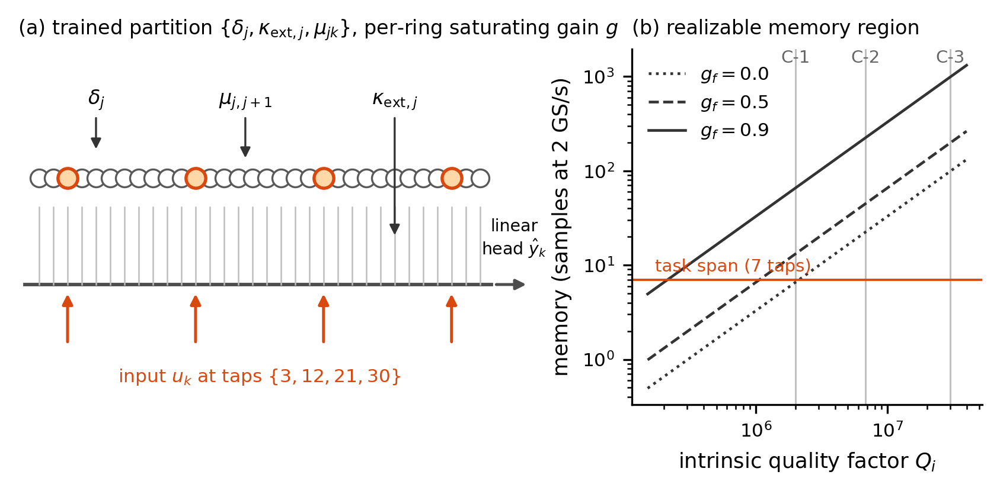

**Figure F1 — Architecture and realizable pole region.** (a) The N = 32 coupled-ring chain
(C-2 cell): trained parameter set {δ_j, κ_ext,j, μ_j,j+1} (ring detunings, bus couplings,
inter-ring couplings), with the resolved four-tap input map B = {3, 12, 21, 30} (§3, §5.7).
(b) Realizable memory (samples at 2 GS/s) versus intrinsic Q at gain fractions
g_f ∈ {0, 0.5, 0.9}, the three registered cells (C-1 foundry-floor, C-2 headline, C-3
aspirational), and the 7-tap task-span line — why the operating point carries gain: at g_f = 0
the foundry-floor cell sits at the task-span line; at the registered g_f = 0.9 all three cells
clear it with margin.

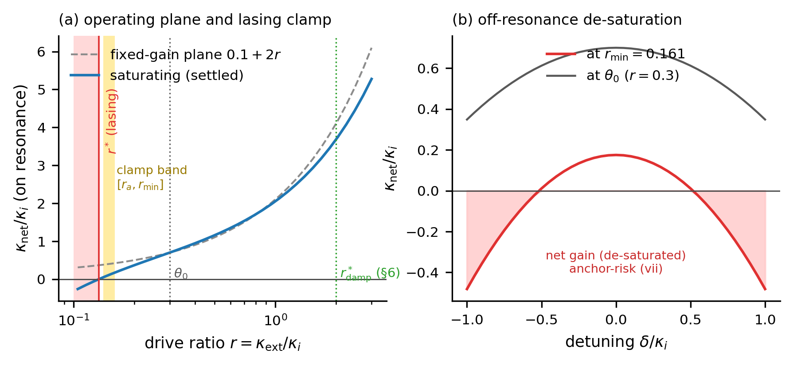

**Figure F2 — The dissipative substrate's operating map.** (a) Settled saturating net loss
κ_net(r) versus the fixed-gain plane, the lasing crossing r\*, the registered clamp band
(r_min = 0.1606 with margin m_κ = 0.05, Δr = 0.02), and the initialization point θ₀. (b)
Off-resonance de-saturation at r_min versus θ₀ — the quantified anchor-risk (vii): a detuned
ring at r_min reaches κ_net = −0.48 κ_i, which is why the clamp is referenced on-resonance
(§3.6).

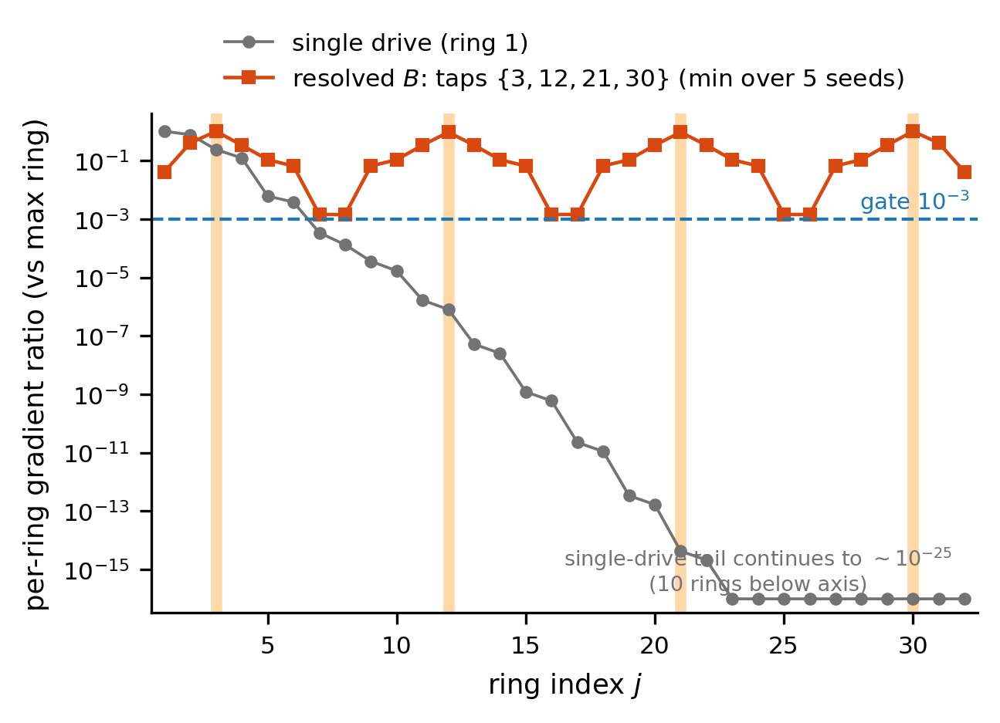

**Figure F3 — Controllability is a first-class constraint.** Per-ring gradient magnitude
(relative to the maximum ring) under a single input tap versus the resolved four-tap map. The
single-drive profile collapses geometrically with distance from the drive (ring 32 sits ~25
orders below the maximum; participation {1, 3, 5}/32 rings above {10⁻¹, 10⁻², 10⁻³}); the
resolved B = {3, 12, 21, 30} puts all 32 rings above the pre-registered 10⁻³ gate (worst ring
1.42 × 10⁻³, min over five drive seeds).

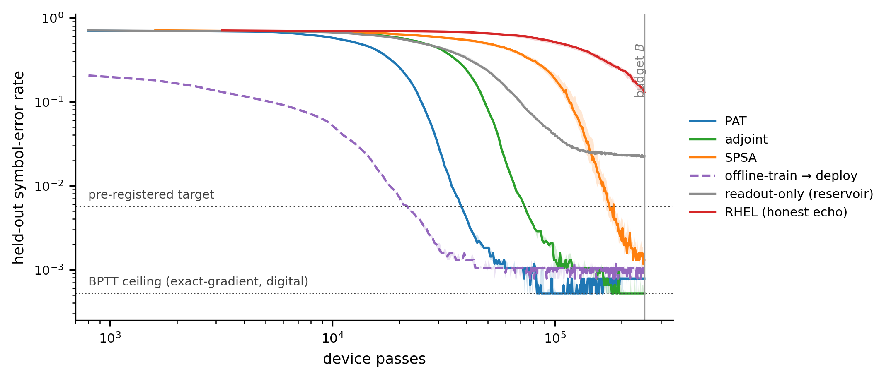

**Figure F4 — Sample efficiency to target (the headline).** Median held-out SER versus
physical device passes at C-2 (8 seeds; shaded IQR): PAT, recurrent adjoint, SPSA, RHEL
(honest echo, censored at budget), the readout-only reservoir baseline, and the offline-deploy
arm (deployed pre-trained, so it starts low; head recalibration only). Dotted lines mark the
BPTT-on-substrate ceiling (device passes = 0 by the PR-7 convention, drawn as a level only) and
the pre-registered target SER = 5.65 × 10⁻³; the vertical line is the device-pass budget
B = 252,800.

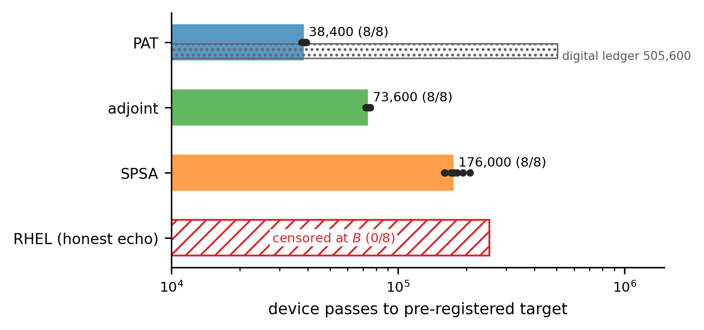

**Figure F5 — Ranking at matched device-pass cost.** Median device passes to target (per-seed
dots) with the digital-computation side-ledger co-reported (hatched; PAT's twin backward =
505,600 digital passes): PAT 38,400 < adjoint 73,600 < SPSA 176,000; RHEL censored 0/8. The
ranking answers the pre-registered promotion question in the negative: neither exact method
beats both workhorses.

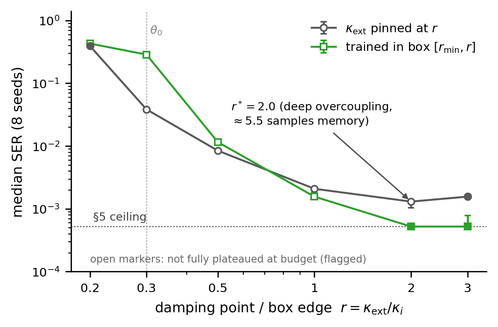

**Figure F6 — Damping is a first-order design knob.** Final SER versus uniform pinned
overcoupling r (plateaued endpoints spanning ×302), the deep-overcoupling optimum r\* = 2.0
(measured κ_net = 3.7 κ_i at the converged solutions, 4.1 fixed-gain estimate — *excess*
memory is harmful for this task), and the trainable-κ_ext box
(R-ii): boxes containing r\* train to the 5 × 10⁻⁴ ceiling, beating every uniform pin — the
heterogeneous damping profile is found by training, not designed. Dashed red: the T-A-L
transfer test (14-tap span, eval-F; PR-17) — the registered prediction that the optimum moves
to lighter damping *failed*; the harder task raises the floor everywhere while the optimum
stays in the deep-overcoupling plateau (r = 2–3 within 13%), so the heavy-damping optimum is
robust to a ×2 task-memory span (§6).

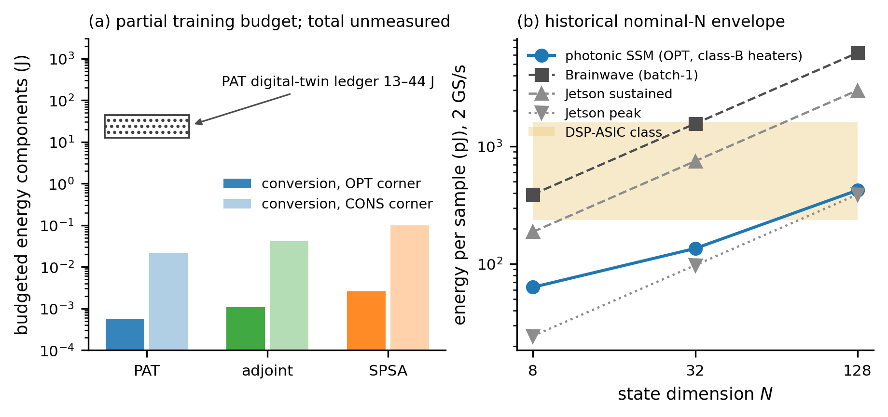

**Figure F7 — Historical systems-envelope components.** (a) Conversion-energy
estimates (SPSA 2.6 mJ OPT / 99 mJ CONS; PAT 0.57 mJ OPT) and PAT's 13–44 J
digital-twin estimate. Writes, settling, and full-duration holding costs are not
included; the plot does not rank total training energy (§7.3, N8). (b) The original
nominal-N inference comparison at 2 GS/s. The later function-matched inline envelope
finds no energy-advantage window under PR-20 (§7.4); this panel is historical context.

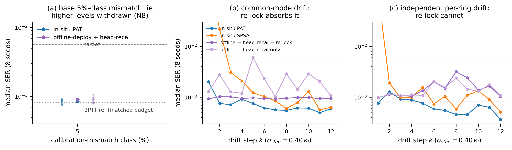

**Figure F8 — What breaks the offline tie (pre-registered follow-ups, §5.5; eval-F protocol
of record, PR-17).** (a) The unaffected base 5%-class mismatch comparison (8 seeds):
PAT and offline-deploy are statistically indistinguishable. Higher-level points
are omitted because PAT's command-binding errors were not scaled as registered;
the previous 30%-robustness interpretation is withdrawn (N8).

(b) Deploy-then-drift, common-mode regime (σ_step = 0.40 κ_i per step on all detunings
coherently): the offline laser re-lock absorbs the drift and keeps pace (ratio 1.34, CI
including zero). (c) Independent per-ring drift: the re-lock cannot fix per-ring pole scatter;
in-situ retraining holds near-ceiling while the re-locking offline baseline degrades with
accumulated drift — **time-integrated ratio 2.42×, difference-CI [+0.71, +2.84] × 10⁻³
excluding zero: both conditions of the frozen decision rule (PR-16: median ratio ≥ 2 AND
difference-CI excludes 0) hold** (the coarse-floor estimate, 1.84×, sat below the bar and is
co-reported per the frozen both-protocols rule; coarse and fine score the *same bit-identical
trajectories* at two floors — ledger §17.8; the ratio's own CI [1.7, 4.6] is reported in
§5.5). The in-situ SPSA curve
is context only (per-step re-convergence transient; no registered verdict involves it).
Dashed/dotted lines: the pre-registered target and the matched-budget BPTT reference
(31,600 updates, the arms' own training budget — PR-17 §17.8; the bake-off's 12,000-update
ceiling is protocol-local to §5.3 and is not drawn).

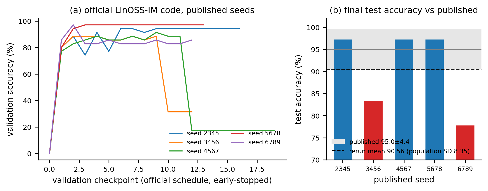

**Figure S1 — The benchmark anchor we do not use (G3 dossier, §8.3).** (a) Validation-accuracy
trajectories of the *official* LinOSS-IM code on the published EigenWorms seeds (our rerun,
2026 stack): two of five seeds visibly collapse mid-training (the fp32 absorbing-zero-gradient
mode). (b) Final test accuracy per seed against the published 95.0 ± 4.4%: rerun mean 90.56%,
σ 9.34 ≈ 2.1× the published dispersion (per-seed 97.22 / 83.33 / 97.22 / 97.22 / 77.78).

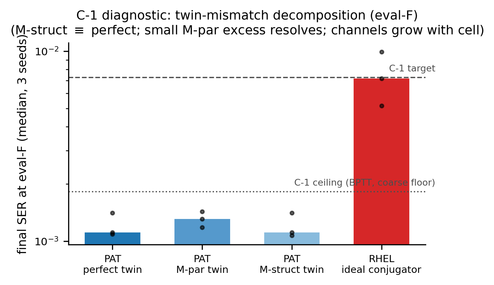

**Figure S2 — Twin-mismatch decomposition at C-1 (§5.6; eval-F).** Final SER (3 seeds) for
PAT with a perfect twin, a parametric-error (M-par) twin, and a structural-omission (M-struct)
twin: perfect and M-struct land identically (1.11 × 10⁻³) while the fine floor resolves a
small M-par excess (1.31 × 10⁻³, +18% — invisible at the coarse floor). Mismatch channels
remain ≈ 0 at this cell only (the dropped gain channel grows to ~8% of gradient direction at
C-2, §5.6). The idealized-conjugator RHEL control clears the C-1 target with a thin margin
(7.2 vs 7.3 × 10⁻³), localizing RHEL's C-2 failure to echo physics, not mechanics.

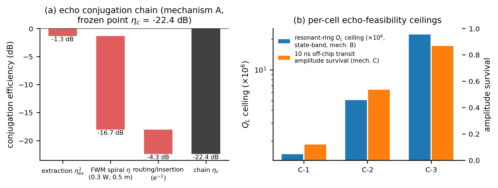

**Figure S3 — The concrete echo sub-model (PR-11, §4).** (a) Conjugation-chain waterfall at
the frozen operating point (mechanism A, shared spiral bank): ring-port extraction η_ex²,
single-pass χ³-FWM spiral conversion (0.3 W pump, 0.5 m), routing/insertion — chain
η_c = −22.4 dB per conjugation. (b) Per-cell feasibility ceilings for the alternative
mechanisms: resonant-ring loaded-Q ceiling from the state bandwidth (mechanism B) and 10-ns
off-chip transit amplitude survival (mechanism C).

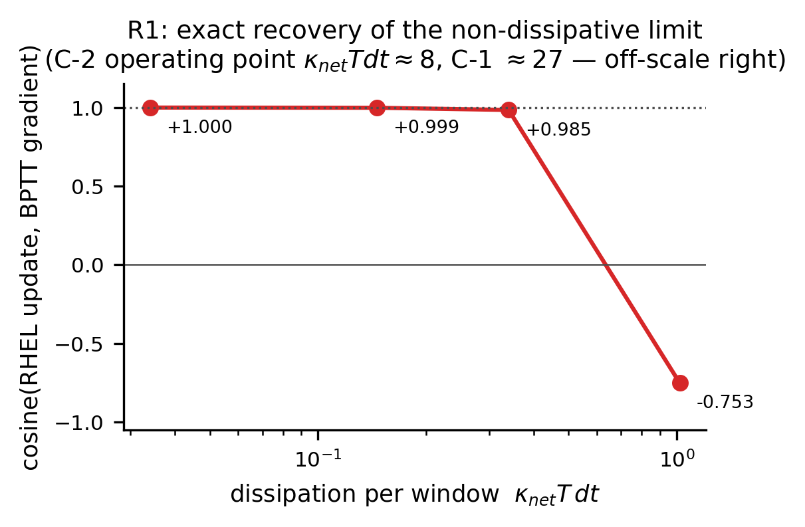

**Figure S5 — RHEL recovers its own theorem's limit (§5.4).** Cosine between the RHEL update
and the exact BPTT gradient as the substrate is made progressively less dissipative: −0.75 at
κ_net T dt ≈ 1.0, monotonically to +1.0000 at 0.03 — exact recovery of the non-dissipative
limit. The registered C-2 operating point sits at κ_net T dt ≈ 8 (the C-1 control cell at
≈ 27), far beyond the anti-aligned
regime: the C-2 failure is dissipative-echo bias, not implementation error.

## References

1. Spall, "Multivariate stochastic approximation using a simultaneous perturbation gradient approximation," IEEE Trans. Autom. Control 37(3), 332–341 (1992)
2. Bandyopadhyay, Sludds, Krastanov, Hamerly, Harris, Bunandar, Streshinsky, Hochberg, Englund, "Single-chip photonic deep neural network with forward-only training," Nat. Photonics 18, 1335–1343 (2024). arXiv:2208.01623
3. Wright, Onodera, Stein, Wang, Schachter, Hu, McMahon, "Deep physical neural networks trained with backpropagation," Nature 601, 549–555 (2022)
4. Hughes, Minkov, Shi, Fan, "Training of photonic neural networks through in situ backpropagation and gradient measurement," Optica 5(7), 864–871 (2018)
5. Tanaka et al., "Recent advances in physical reservoir computing: A review," Neural Networks 115, 100–123 (2019); Van der Sande, Brunner, Soriano, "Advances in photonic reservoir computing," Nanophotonics 6(3), 561–576 (2017)
6. Jayatilleka et al., "Wavelength tuning and stabilization of microring-based filters using silicon in-resonator photoconductive heaters," Opt. Express 23(19), 25084–25097 (2015); Mak, Sacher, Xue, Mikkelsen, Yong, Poon, "Automatic Resonance Alignment of High-Order Microring Filters," IEEE JQE 51(11) (2015); Milanizadeh, Aguiar, Melloni, Morichetti, "Canceling Thermal Cross-Talk Effects in Photonic Integrated Circuits," JLT 37(4), 1325–1332 (2019)
7. Bueno, Maktoobi, Froehly, Fischer, Jacquot, Larger, Brunner, "Reinforcement learning in a large-scale photonic recurrent neural network," Optica 5(6), 756–760 (2018)
8. Böhm, Verschaffelt, Van der Sande, "A poor man's coherent Ising machine based on opto-electronic feedback systems…," Nat. Commun. 10, 3538 (2019); companion: Böhm et al., Nat. Commun. 13, 5847 (2022)
9. Wu et al., "Monolithically integrated asynchronous optical recurrent accelerator," eLight 5, 7 (2025)
10. Ashtiani, Idjadi, Kim, "Integrated photonic neural network with on-chip backpropagation training," Nature 651, 927–932 (2026). arXiv:2506.14575
11. Zhao et al., "In-Situ Trained Microring-Based Neural Networks," Laser Photon. Rev. (2025), 10.1002/lpor.202501576
12. Wu, Ren et al., "Time-synthetic optical neural networks with stable programmable gain," arXiv:2507.02297 (retitled from "A scalable and programmable optical neural network in a time-synthetic dimension")
13. Zhang, Wang, Lederman, Shastri, Prucnal et al., "Compact, reconfigurable, and scalable photonic neurons by modulation-and-weighting microring resonators," eLight 6, 6 (2026). arXiv:2505.11369
14. "In-situ optimization of an optoelectronic reservoir computer with digital delayed feedback," ACS Photonics (2025). arXiv:2502.11126
15. "Real-time optical signal equalization with a silicon photonic spatially distributed reservoir computer," Nat. Photonics (2026). arXiv:2503.19911 (Ghent/imec)
16. Gu, Goel, Ré, "Efficiently Modeling Long Sequences with Structured State Spaces," ICLR 2022. arXiv:2111.00396
17. Gu, Gupta, Goel, Ré, "On the Parameterization and Initialization of Diagonal State Space Models," NeurIPS 2022. arXiv:2206.11893
18. Rusch, Rus, "Oscillatory State-Space Models," ICLR 2025 (Oral). arXiv:2410.03943
19. Boyer, Rusch, Rus, "Learning to Dissipate Energy in Oscillatory State-Space Models," arXiv:2505.12171
20. Cui, Cao, Pan, Gao, Yu, Zhang, "Compact microring resonator based on ultralow-loss multimode silicon nitride waveguide," Adv. Photonics Nexus 2(4), 046007 (2023)
21. Gupta, Gu, Berant, "Diagonal State Spaces are as Effective as Structured State Spaces," NeurIPS 2022. arXiv:2203.14343
22. Haus, *Waves and Fields in Optoelectronics*, Prentice-Hall (1984)
23. Gorodetsky, Pryamikov, Ilchenko, "Rayleigh scattering in high-Q microspheres," JOSA B 17(6), 1051–1057 (2000); Kippenberg, Spillane, Vahala, "Modal coupling in traveling-wave resonators," Opt. Lett. 27(19), 1669–1671 (2002)
24. Liu, Huang, Wang, He, Raja, Liu, Engelsen, Kippenberg, "High-yield, wafer-scale fabrication of ultralow-loss, dispersion-engineered silicon nitride photonic circuits," Nat. Commun. 12, 2236 (2021)
25. Rukh, Colación, Buck, Drake, "Process-structure-property relationships in subtractive fabrication of silicon nitride microresonators for nonlinear photonics," arXiv:2511.02198 (2025)
26. Liu, Qiu, Ji, Lukashchuk, He, Riemensberger, Hafermann, Wang, Liu, Ronning, Kippenberg, "A photonic integrated circuit-based erbium-doped amplifier," Science 376, 1309–1313 (2022)
27. Ye, Marpaung, "Compact multi-mode silicon-nitride micro-ring resonator with low loss," Adv. Photonics 5(5), 050503 (2023)
28. Talandier, multi-layer photonic-equalization manuscript (in preparation) + chip β-track thermal-crosstalk/perturbation-tolerance results
29. Pourcel, Ernoult, "Learning long range dependencies through time reversal symmetry breaking," arXiv:2506.05259 (2025)
30. López-Pastor, Marquardt, "Self-Learning Machines Based on Hamiltonian Echo Backpropagation," Phys. Rev. X 13, 031020 (2023). arXiv:2103.04992
31. Riemensberger, Kuznetsov, Liu, He, Wang, Kippenberg, "A photonic integrated continuous-travelling-wave parametric amplifier," Nature 612, 56–61 (2022); Krückel et al., "Continuous wave-pumped wavelength conversion in low-loss silicon nitride waveguides," Opt. Lett. 40(6), 875–878 (2015)
32. this work: PR-15 two-modality search + refresh memos, supplementary N3; public repository `github.com/LTalandier/Project_SSM`
33. Dacha, Zhao, McNulty, Bhatt, Lipson, Gaeta, "Frequency-stable nanophotonic microcavities via integrated thermometry," Nature Photonics (2025). arXiv:2506.21692
34. Gao, Rios-Navarro, Chen, Liu, Delbruck, "EdgeDRNN: Recurrent Neural Network Accelerator for Edge Inference," IEEE JETCAS 10(4), 419–432 (2020). arXiv:2012.13600
35. Gu, Dao, "Mamba: Linear-Time Sequence Modeling with Selective State Spaces," COLM 2024 (Outstanding Paper). arXiv:2312.00752
