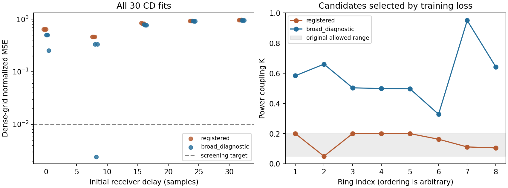

# PR-23-C capacity diagnostic — 2026-09-20

Pre-run commit: `947d877f548df49bb3f55bcccebab9b89062c102`; runtime 21.60 s; cloud spend €0.
Completed 36/36 fits.

All three nearby synthetic starts recover the known response below the 1e-6 target.
All three distant starts get stuck (dense NMSE 0.359–0.552) despite exact gradients.
The model and local optimizer can fit a realizable target; global optimization remains unresolved.

| Coupling range | Best training NMSE | Dense NMSE, fixed receiver scalar | Seed | Initial / fitted delay, samples |
|---|---:|---:|---:|---:|
| registered [0.05, 0.2] | 0.46126776 | 0.46132101 | 33 | 8.0 / 8.9345 |
| broad_diagnostic [0.01, 0.95] | 0.00241329 | 0.00238687 | 22 | 8.0 / 6.4063 |

Only broad diagnostic passes; no go for original registered range.

The broad candidate has K = 0.5837, 0.6604, 0.5036, 0.4986, 0.4973, 0.3282, 0.9500, 0.6416.
Only one of the 15 broad-range starts passes the .01 screening target; optimization is fragile. All eight couplings of that candidate exceed the original .20 maximum. This is a constructive noiseless approximation in an expanded mathematical design space, not a realization within PR-22.

The original-range best has 46.13% residual power; the broad best has 0.2387% (26.22 dB residual suppression).
These are normalized complex-field MSEs, not BER or a demonstrated communication link. No noise, finite actuator resolution, coupler excess loss, drift, nonlinearities or thermal budget is modeled here.

Selection was by training loss, with a separate 2048-point midpoint grid and no receiver refit. All candidates and controls are archived; no extra starts or tuning followed the registered grid.
Near-start success is not global identifiability: phases wrap, rings permute, and distant starts failed. The poor restricted fit is not a lower bound on the best possible restricted design.
The broad arm changes initialization as well as coupling bounds (zero logits imply K=.48 instead of .125); this is not a controlled causal estimate of the effect of widening bounds.

Next gate: before any adaptive-drift run, justify the broad coupling range with a feasible tunable-coupler model including excess loss/actuation, and freeze a matched-observation adaptive baseline. No paid fleet or hardware step follows from this result.

Reproduce: `python3 -m analysis.s0c_capacity` (optimization) and `python3 -m analysis.s0c_capacity_report` (report only).

