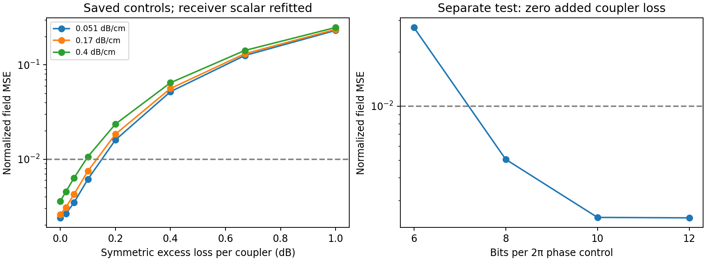

# Wide-coupler sensitivity — PR-23-D

Pre-run commit `8f58f6d792677ad71b07c4da19dfcd6be0eb5b7f`; local arithmetic, €0 cloud; no retraining.

Sources, derivation and interpretation: `docs/s0c/coupler_feasibility_2026-09-22.md`.

| Coupler excess dB | Propagation dB/cm | NMSE | Mean IL dB, incl. package | Receiver noise increase dB | Shape screen |
|---:|---:|---:|---:|---:|---|
| 0 | 0.051 | 0.002387 | 3.078 | 3.067 | pass |
| 0.02 | 0.051 | 0.002632 | 3.436 | 3.425 | pass |
| 0.05 | 0.051 | 0.003474 | 3.970 | 3.955 | pass |
| 0.1 | 0.051 | 0.006129 | 4.848 | 4.822 | pass |
| 0.2 | 0.051 | 0.015990 | 6.565 | 6.495 | fail |
| 0.4 | 0.051 | 0.052030 | 9.842 | 9.610 | fail |
| 0.67 | 0.051 | 0.125725 | 13.969 | 13.385 | fail |
| 1.0 | 0.051 | 0.232213 | 18.636 | 17.488 | fail |
| 0 | 0.17 | 0.002598 | 3.258 | 3.246 | pass |
| 0.02 | 0.17 | 0.003073 | 3.614 | 3.601 | pass |
| 0.05 | 0.17 | 0.004256 | 4.145 | 4.126 | pass |
| 0.1 | 0.17 | 0.007471 | 5.018 | 4.986 | pass |
| 0.2 | 0.17 | 0.018398 | 6.725 | 6.645 | fail |
| 0.4 | 0.17 | 0.056217 | 9.984 | 9.733 | fail |
| 0.67 | 0.17 | 0.131321 | 14.090 | 13.478 | fail |
| 1.0 | 0.17 | 0.238106 | 18.737 | 17.556 | fail |
| 0 | 0.4 | 0.003594 | 3.600 | 3.584 | pass |
| 0.02 | 0.4 | 0.004508 | 3.953 | 3.933 | pass |
| 0.05 | 0.4 | 0.006345 | 4.478 | 4.450 | pass |
| 0.1 | 0.4 | 0.010628 | 5.342 | 5.296 | fail |
| 0.2 | 0.4 | 0.023568 | 7.030 | 6.927 | fail |
| 0.4 | 0.4 | 0.064679 | 10.255 | 9.964 | fail |
| 0.67 | 0.4 | 0.142281 | 14.320 | 13.654 | fail |
| 1.0 | 0.4 | 0.249447 | 18.931 | 17.684 | fail |

Receiver-noise increase refers to fixed additive noise after filtering; this is not a BER prediction.
Pass/fail is only the prior .01 noiseless shape-error screen. Scalar gain does not restore SNR.

| Phase bits over 2π | NMSE at zero added coupler loss |
|---:|---:|
| 6 | 0.027364 |
| 8 | 0.005064 |
| 10 | 0.002409 |
| 12 | 0.002396 |

Loss and quantization are separate sensitivities, not combined pass conditions.

| Assumed Pπ, mW | Heater mW | Heater + assumed controls, mW | Subtotal pJ/sample at 64 GS/s |
|---:|---:|---:|---:|
| 1 | 10.98 | 42.98 | 0.672 |
| 15 | 164.64 | 196.64 | 3.073 |
| 60 | 658.58 | 690.58 | 10.790 |
| 100 | 1097.63 | 1129.63 | 17.650 |

Subtotals omit locking, amplification, monitoring and refresh. Pπ scenarios are not measurements of this design.
No complete source-backed device budget, function-matched digital comparison, or product go.

